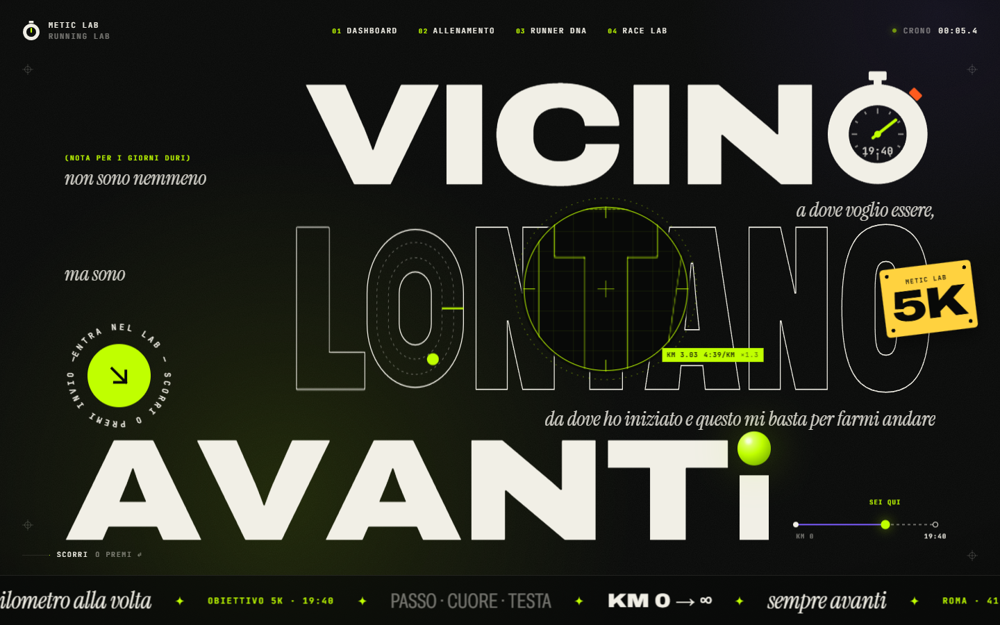
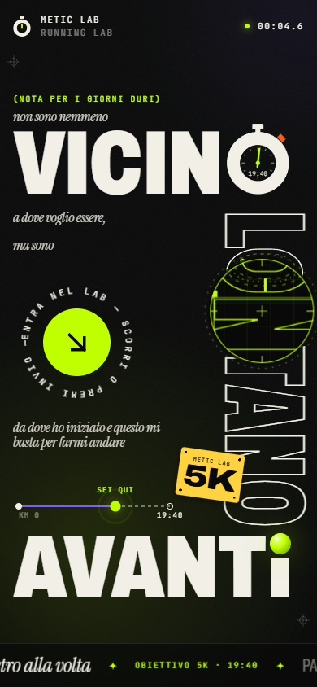
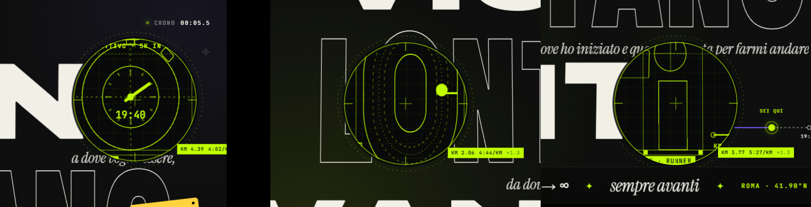
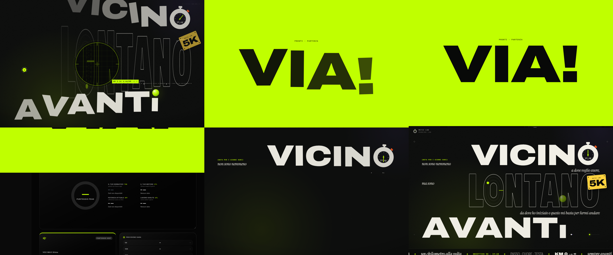

# METIC LAB — Hero page running

Guida completa per ricostruire **in modo identico** la hero page che si apre prima della dashboard di METIC LAB: concept, misure, layout, coreografia, interazioni, integrazione e **tutto il codice sorgente** (copiato dai file reali del progetto, non riassunto).



| Mobile 390×844 | Lente sui glifi · Ingresso e uscita |
|---|---|
|  |   |

> Le immagini stanno in `docs/hero-page/img/`. Se hai scaricato solo questo file, le immagini non si vedono: il testo e il codice bastano per rifarla identica.

---

## Indice

1. [Cos'è](#1-cosè)
2. [Stack e dipendenze](#2-stack-e-dipendenze)
3. [Struttura dei file](#3-struttura-dei-file)
4. [Il concept](#4-il-concept)
5. [Misure tipografiche](#5-misure-tipografiche)
6. [Layout desktop](#6-layout-desktop)
7. [Layout mobile e tablet verticale](#7-layout-mobile-e-tablet-verticale)
8. [Colori, font, sfondo](#8-colori-font-sfondo)
9. [Coreografia d'ingresso](#9-coreografia-dingresso)
10. [Movimento a riposo e cursore](#10-movimento-a-riposo-e-cursore)
11. [La lente (X-ray)](#11-la-lente-x-ray)
12. [Uscita: scroll, click, tastiera](#12-uscita-scroll-click-tastiera)
13. [Movimento ridotto e accessibilità](#13-movimento-ridotto-e-accessibilità)
14. [Performance](#14-performance)
15. [Ricostruzione passo passo](#15-ricostruzione-passo-passo)
16. [Checklist di verifica](#16-checklist-di-verifica)
17. [Personalizzare](#17-personalizzare)
18. [Codice sorgente completo](#18-codice-sorgente-completo)

---

## 1. Cos'è

Una hero a tutto schermo (100svh) che si sovrappone al sito all'apertura. È un poster tipografico costruito sulla frase:

> non sono nemmeno vicino a dove voglio essere,
> ma sono lontano da dove ho iniziato
> e questo mi basta per farmi andare avanti.

Tre parole enormi — **VICINO / LONTANO / AVANTI** — portano la frase; le parole di collegamento sono piccole, in corsivo, nell'ordine di lettura. Una lente lime segue il cursore e mostra la "costruzione" del poster. Si entra nella dashboard scorrendo, cliccando il disco ENTER, premendo Invio o scegliendo una voce della nav: la lente riempie lo schermo di lime, compare **"Pronti · partenza — VIA!"** e la hero scorre via verso l'alto.

Riferimento di art direction studiato (non copiato): tigranz.com — un'idea dominante, colore concentrato in pochi oggetti, enorme salto di scala fra display e UI, tempi lunghi e pazienti.

---

## 2. Stack e dipendenze

Il sito è una SPA **Vite + React 19 + TypeScript**. La hero vive dentro l'app (non è un progetto Next.js separato).

| Pacchetto | Versione | Uso |
|---|---|---|
| `react`, `react-dom` | ^19.0.0 | componenti; `inert` come prop booleana |
| `react-router-dom` | ^7.13.2 | `useNavigate` per entrare a una route |
| `vite` | ^6.2.0 | build, code splitting (`App` lazy) |
| `tailwindcss` + `@tailwindcss/vite` | ^4.1.14 | usate solo le utility `sr-only` e `contents`; il resto è `hero.css` |
| `gsap` | ^3.15.0 | timeline, `CustomEase`, `MotionPathPlugin` (plugin inclusi nel pacchetto npm) |
| `motion` | ^12.38.0 | molle del magnetismo (`motion/react`) |
| `lenis` | ^1.3.26 | scroll morbido sullo scroller della hero, che guida l'uscita |

```bash
npm i gsap@^3.15.0 motion@^12.38.0 lenis@^1.3.26
```

Font da Google Fonts: **Archivo** variabile (assi `wdth` 62–125 e `wght` 100–900), **Instrument Serif** corsivo, **JetBrains Mono** (già usato dall'app).

---

## 3. Struttura dei file

```
index.html                              font della hero + fondo scuro prima del JS
src/main.tsx                            App lazy dentro <IntroGate>
src/components/hero/
├── IntroGate.tsx                       quando mostrare la hero, monta l'app sotto
├── IntroHero.tsx                       coreografia, Lenis, loop unico del cursore
├── HeroArtwork.tsx                     sfondo + poster pieno + lente con il gemello X-ray
├── AnimatedWordmark.tsx                il poster della frase (renderizzato 2 volte)
├── HeroGlyphs.tsx                      cronometro-O, pista-O, i con pallina, pettorale, marchi
├── CursorLens.tsx                      la lente
├── HeroNav.tsx                         nav con cronometro gara
├── Marquee.tsx                         ticker infinito senza salti
├── EnterDisc.tsx                       disco ENTER con anello di testo
├── Magnetic.tsx                        magnetismo con molle Motion
├── heroContent.ts                      TUTTI i testi e i dati
├── heroMotion.ts                       easing custom, plugin, helper
└── hero.css                            tutto lo stile della hero
```

---

## 4. Il concept

**"La frase, letta come una corsa."** La composizione è un zig-zag sinistra/destra, come una linea sulla pista. L'unica idea memorabile è la **lente lime**: legge il poster come METIC LAB legge una corsa (contorni, linee di costruzione, e un readout che trasforma la posizione del cursore in una gara: x = km della gara obiettivo, y = passo al km).

Oggetti disegnati (tutti in `em`, quindi seguono il corpo della parola):

| Oggetto | Dove | Dettagli |
|---|---|---|
| **Cronometro** | la O di VICINO | anello spesso come il tratto della lettera, corona, pulsante start arancione a 45°, 12 tacche, lancetta lime, tempo obiettivo sul quadrante |
| **Pista 400 m** | la O di LONTANO | contorno esterno e interno della O condensata, due corsie tratteggiate, linea d'arrivo lime, runner lime che gira in senso antiorario |
| **i con pallina** | la I di AVANTI | asta corta + sfera lime che cade, si schiaccia e oscilla |
| **Pettorale** | in fondo a LONTANO | giallo, 4 spille, "METIC LAB" + distanza obiettivo |
| **Percorso** | accanto ad AVANTI | `Km 0 ●━━━◉ sei qui ┄┄○ tempo obiettivo` |

L'obiettivo (gara e tempo) viene da `KIKKO_SUB20_META` del piano di allenamento: quadrante, pettorale, percorso e ticker non promettono mai un tempo vecchio.

---

## 5. Misure tipografiche

Misurate con Playwright (Edge headless) su Archivo variabile, font-size 100px:

| Misura | Valore |
|---|---|
| Cap height | **0.69em** |
| Ascent / descent | 0.88em / 0.21em |
| Baseline in un box `line-height: 1` | 0.83em dall'alto |
| `line-height: 0.7` → il box di riga coincide con la cap height | cap top ≈ 0, baseline ≈ 0.685em |

Larghezze parole (`font-weight: 900`):

| Parola | wdth 125 | wdth 100 | wdth 87.5 | wdth 75 | wdth 62 |
|---|---|---|---|---|---|
| VICINO | 4.682em | 3.960 | 3.512 | 3.066 | 2.601 |
| LONTANO | 6.457em | 5.389 | 4.764 | 4.139 | **3.491** |
| AVANTI | **4.985em** | 4.158 | 3.692 | 3.229 | 2.746 |
| O | 1.008em | 0.833 | 0.741 | 0.649 | 0.554 |
| I | 0.395em | 0.369 | 0.334 | 0.299 | 0.263 |

Frasi in Instrument Serif corsivo (larghezza in em): "non sono nemmeno" 7.09 · "a dove voglio essere," 7.00 · "ma sono" 3.04 · "da dove ho iniziato" 6.91 · "e questo mi basta per farmi andare" 12.54.

Regole che ne derivano:

- Ogni parola gigante usa `line-height: 0.7`, così un glifo disegnato alto `0.69em` e senza contenuto in flusso si appoggia esattamente sulla baseline.
- Dividere una parola in `<span>` perde la crenatura: le coppie AV, VA, TA, AT, TI, LO, VI la recuperano a mano in `AnimatedWordmark.tsx`.
- Il poster è un contenitore `container-type: inline-size`: tutto il layout è in `cqw`, quindi scala come una sola tavola.

---

## 6. Layout desktop

Larghezza tavola: `--W: min(92vw, (100svh − nav 88 − ticker 72 − 80px) × 1.9)`. Griglia `25cqw | 1fr`.

```
┌───────────────────────────────────────────────────────────────────────┐
│ ◷ METIC LAB      01 DASHBOARD 02 ALLENAMENTO 03 RUNNER DNA 04 RACE LAB   ● CRONO 00:05.4 │
│                                                                       │
│ (NOTA PER I GIORNI DURI)                                               │
│ non sono nemmeno            V I C I N ◷        ← 16.6cqw, wdth 125     │
│                                        a dove voglio essere,   (dx)   │
│ ma sono                     L ⬭ N T A N O  [5K] ← 20.5cqw, wdth 62,    │
│ (ENTER)                                          outline, scaleY 1.32 │
│             da dove ho iniziato e questo mi basta per farmi andare (dx)│
│ A V A N T i●                                    Km0 ●━━◉━┄┄○ 19:40      │
├───────────────────────────────────────────────────────────────────────┤
│ ✦ Metic Lab ✦ un chilometro alla volta ✦ OBIETTIVO 5K · 19:40 ✦ …      │
└───────────────────────────────────────────────────────────────────────┘
```

| Elemento | Cella | Allineamento |
|---|---|---|
| kicker + "non sono nemmeno" | col 1, riga 1 | in basso (baseline di VICINO) |
| VICINO | col 2, riga 1 | a destra |
| "a dove voglio essere," | col 2, riga 2 | a destra |
| "ma sono" | col 1, riga 3 | in alto (cap line di LONTANO) |
| disco ENTER | col 1, righe 3–4 | in basso |
| LONTANO + pettorale | col 2, riga 3 | a destra |
| "da dove ho iniziato e questo…" | col 2, riga 4 | a destra |
| AVANTI | col 1–2, riga 5 | a sinistra |
| percorso | col 1–2, riga 5 | a destra, in basso |

Nav 88px fissa in alto, ticker 72px in basso con filetto sopra, marchi di registro negli angoli.

---

## 7. Layout mobile e tablet verticale

Attivo con `@media (max-width: 767px), (max-width: 1100px) and (orientation: portrait)`. È ricomposto, non rimpicciolito.

```
◷ METIC LAB                    ● 00:04.6
(NOTA PER I GIORNI DURI)
non sono nemmeno
V I C I N ◷                      ← 31cqw, wdth 75
a dove voglio essere,        L
ma sono                      ⬭   ← LONTANO: colonna sul bordo destro,
   (ENTER)                   N      letta dall'alto (rotate 90°)
da dove ho iniziato e        T
questo mi basta per farmi    A
andare                  [5K] N
Km0 ●━━◉┄┄○ 19:40            O
A V A N T i●                     ← 30.5cqw, wdth 75
✦ ticker ✦
```

- Tavola: `min(100vw − 32px, (100svh − 64 − 54 − 36px) × 0.58)`.
- Colonna di LONTANO: cella larga `0.7em × 1.3`, alta `3.56em`; la riga dentro ha `transform: translateX(0.91em) rotate(90deg) scaleY(1.3)` con origine `0 0`.
- Nav: solo logo e cronometro. Readout della lente nascosto. La lente va da sola lungo una curva di Lissajous; un tap la sposta per 2,6s.

---

## 8. Colori, font, sfondo

| Token | Valore | Uso |
|---|---|---|
| `--h-ink` | `#080908` | fondo |
| `--h-paper` | `#F1EFE6` | testo, UI |
| `--h-lime` | `#C0FF00` | pallina, lancetta, runner, "sei qui", lente, ENTER, portale |
| `--h-violet` | `#7C5CFF` | distanza già corsa sul percorso |
| `--h-orange` | `#FF5B1F` | pulsante del cronometro |
| `--h-yellow` | `#FFD23F` | pettorale |

- Sfondo: `#080908` + grana SVG statica (`feTurbulence`, opacità 0.075) + bagliore radiale lime in basso a sinistra (≤ 12% alfa) + bagliore viola in alto a destra (≤ 8.5%) + vignetta. **Nessun filtro blur.**
- Display: Archivo 900, `font-stretch` 125% (VICINO, AVANTI) e 62% con contorno (LONTANO).
- Frasi: Instrument Serif corsivo, `clamp(15px, 2.35cqw, 40px)`, colore paper 86%.
- UI: JetBrains Mono 9–11px, maiuscolo, tracking 0.12–0.16em.

---

## 9. Coreografia d'ingresso

Una sola timeline GSAP che "legge" la frase. Easing custom:

| Nome | Curva | Uso |
|---|---|---|
| `hero.out` | `M0,0 C0.12,0.9 0.2,1 1,1` | arrivo lungo e deciso (default) |
| `hero.pop` | `M0,0 C0.3,1.6 0.55,1 1,1` | oggetti con overshoot |
| `hero.inOut` | `M0,0 C0.7,0 0.2,1 1,1` | uscita e sipario |
| `hero.in` | `M0,0 C0.5,0 0.9,0.5 1,1` | caduta |

| t (s) | Battuta |
|---|---|
| 0.00 | grana e bagliori |
| 0.10 | kicker, "non sono nemmeno" (maschera, yPercent 115 → 0) |
| 0.25 | lettere di VICINO: yPercent 75, rotazione ±13°, scala 0.7, stagger 0.055 |
| 0.45 | cronometro pop (scala 0, −90°) · 0.50 lancetta −720° → 0 in 1.9s |
| 0.80 | "a dove voglio essere," · 0.98 "ma sono" |
| 1.05 | lettere di LONTANO crescono da scaleY 0 dalla baseline, stagger 0.045 |
| 1.50 | "da dove ho iniziato e questo mi basta per farmi andare" |
| 1.62 | lettere di AVANTI: yPercent 70, ±11°, scala 0.75, stagger 0.05 |
| 1.70 | pettorale cade e oscilla · 1.85 runner appare |
| 2.10 | pallina cade sulla i (0.52s), schiaccia (scaleX 1.3 / scaleY 0.7), elastic.out(1, 0.32) |
| 2.20 | percorso si disegna, pallini pop, marchi di registro |
| 2.35 | ticker sale · 2.40 nav scende · 2.55 disco ENTER · 2.70 lente · 2.85 suggerimento |

Qualsiasi input durante l'ingresso (rotella, touch, tasto) lo accelera ×3. Nulla è visibile finché la timeline non ha impostato gli stati iniziali (classe `is-live`), e la timeline parte solo dopo i font (attesa massima 1.2s).

---

## 10. Movimento a riposo e cursore

- Lancetta: un giro ogni 9s (`svgOrigin: "50 50"`).
- Runner: `MotionPathPlugin` sul tracciato della corsia 2, 6.5s a giro, da `start: 1.453` a `end: 0.453` (antiorario, partenza dalla linea d'arrivo).
- Pettorale: oscillazione 3.5° in 2.4s. Pallina: yPercent −11 in 1.5s. Bagliori alla deriva in 9–11s. Anello ENTER: un giro in 20s.
- Parallasse (solo puntatori fini): tipo ±14/10px, oggetti ×`data-depth` (1.4–2.2), bagliori ±22/16px in direzione opposta. Scritto dentro **un solo** callback `gsap.ticker`, mai stato React.
- Lettere vicine al cursore (raggio 240px): `scaleY` fino a 1.11 e `skewX` fino a ±7°; a riposo il transform viene rimosso del tutto (un `scaleY(1.0004)` residuo rende la lettera sfocata).
- Magnetismo: disco ENTER (0.4 / 0.18) e voci nav (0.28 / 0.12) con molle Motion `stiffness 220, damping 18, mass 0.6`.
- Ticker: 64 px/s; al passaggio del mouse rallenta a `timeScale 0.25`.

---

## 11. La lente (X-ray)

Il poster è renderizzato **due volte con markup identico**: una copia piena e un gemello X-ray dentro la lente. GSAP anima entrambe con gli stessi selettori, quindi non si separano mai.

- Movimento senza repaint: la lente trasla di `(cx − R, cy − R)`, l'interno trasla di `(R − cx·1.3, R − cy·1.3)` e scala 1.3 → ingrandimento vero centrato sul cursore. Niente `clip-path`.
- Nel gemello: lettere col solo contorno lime, cap line tratteggiata e baseline, box con maniglie sugli oggetti, etichette ("O · CRONO", "O · PISTA 400 M", "I · RUNNER", "PETTORALE", "START · Ø"), specifiche sopra le parole ("OBIETTIVO · 5K IN 19:40", "KM 0 · PARTENZA · PISTA 400 M", "CADENZA 180 SPM · FC 168 BPM"), griglia 22px.
- Readout: `KM (x/w × km gara)` e passo `3:30 → 6:00 /km` lungo y, aggiornato ogni 90ms.
- Ghiera esterna: ruota con la velocità orizzontale del cursore.
- Sopra un controllo la lente diventa un anellino con `mix-blend-mode: difference`. **Tutto dentro la lente ha `pointer-events: none`** (altrimenti lo slot fantasma del CTA ruba i click).
- A riposo si ferma sulla 4ª lettera di LONTANO, al 36% dell'altezza.

---

## 12. Uscita: scroll, click, tastiera

La hero è uno scroller `position: fixed` alto `100svh + max(100svh, 860px)` con uno stage `sticky`. Lenis (`lerp 0.085`, `wheelMultiplier 0.85`) guida la timeline d'uscita in pausa: `exit.progress(scroll / limit)`.

Timeline d'uscita (≈ 2.6s, a 1.35× se parte da click o Invio):

| t | Cosa |
|---|---|
| 0.00 | nav su, ticker giù, suggerimento/marchi/percorso spariscono, frasi escono dalla maschera, disco ENTER si chiude |
| 0.05–0.12 | VICINO vola su, LONTANO si allunga e sparisce, pettorale vola via, AVANTI cade |
| 0.00–0.70 | la lente si sposta al centro |
| 0.30 | la lente scala fino a coprire lo schermo |
| 0.72 | riempimento lime |
| 1.00 | "Pronti · partenza" + lettere di "VIA!" |
| 1.60 | lo stage scorre in su (yPercent −100) sopra la dashboard |

- Rilascio a metà: dopo 180ms fermo, sopra il 30% completa, sotto torna a 0.
- Click sul disco o Invio: gioca l'uscita. Voce nav: naviga alla route e gioca l'uscita. Esc: dissolvenza di 0.25s.
- Appena l'uscita parte, lo stato hover della lente viene annullato (altrimenti il lime resta invisibile).

---

## 13. Movimento ridotto e accessibilità

- `prefers-reduced-motion`: solo dissolvenze (0.5s), niente stagger/parallasse/idle/distorsione, lente ferma, runner parcheggiato sulla linea d'arrivo, ticker fermo, cronometro nav a 1s; qualsiasi scroll entra con una dissolvenza.
- `<h1 class="sr-only">` con la frase completa; tutto il poster è `aria-hidden`.
- L'app sotto è montata dentro un `div.contents` con `inert` finché la hero è aperta.
- Focus visibile lime su nav e disco; il root della hero riceve il focus per la tastiera.
- La hero non compare con `?strava_code=` (ritorno OAuth) né con `?intro=0`.

---

## 14. Performance

- Si animano solo `transform` e `opacity` (più `strokeDashoffset` dove serve).
- Un unico loop `gsap.ticker` per cursore, parallasse, lente e distorsione.
- `App` è un chunk lazy richiesto a fine ingresso: il JS iniziale scende da 648 kB a 315 kB (gzip 106 kB), e il rendering della dashboard non compete con la coreografia.
- Misurato a 1440×900: frame peggiore a riposo **7.2 ms** (budget 60fps = 16.7ms).
- L'avviso di build > 600 kB riguarda `vendor-mapbox` (già esistente, lazy), non la hero.

---

## 15. Ricostruzione passo passo

1. Installa le dipendenze (sezione 2).
2. In `index.html` aggiungi preconnect + foglio Google Fonts e `html,body{background:#080908}` (sezione 18).
3. Crea `src/components/hero/` e copia **tutti** i file della sezione 18 con gli stessi nomi.
4. In `src/main.tsx` rendi `App` lazy e avvolgilo in `<IntroGate>` dentro `<BrowserRouter>` (sezione 18).
5. Assicurati che `@import "tailwindcss"` sia attivo (servono `sr-only` e `contents`).
6. `heroContent.ts` importa `KIKKO_SUB20_META` da `src/data/kikkoSub20Plan.ts`. In un altro progetto sostituisci l'import con:

   ```ts
   const KIKKO_SUB20_META = { goalRace: "5K", goalTime: "19:40" };
   ```

7. `npx tsc --noEmit`, `npx eslint src/components/hero`, `npm run build`.
8. Apri il sito e segui la checklist qui sotto.

---

## 16. Checklist di verifica

- [ ] 1440×900: VICINO a destra con cronometro, LONTANO a contorno con pista e runner, pettorale 5K, AVANTI con pallina, percorso a destra.
- [ ] L'ingresso segue l'ordine di lettura; nav e ticker arrivano per ultimi (~3.6s).
- [ ] La lente segue il cursore, ingrandisce 1.3× e mostra il gemello X-ray allineato; il readout mostra km e passo.
- [ ] Le lettere vicine al cursore si allungano; a riposo non hanno transform.
- [ ] Sopra il disco ENTER la lente diventa un anellino; il disco è magnetico.
- [ ] Scroll: l'uscita segue la rotella; rilasciata oltre il 30% completa, sotto torna indietro.
- [ ] Click/Invio: lime → "Pronti · partenza — VIA!" → dashboard; la hero viene smontata.
- [ ] Voce "Allenamento": entra direttamente su `/training`. Esc salta.
- [ ] 390×844 e 768×1024: layout poster con LONTANO in verticale.
- [ ] `prefers-reduced-motion`: solo dissolvenze. `?intro=0`: niente hero.

---

## 17. Personalizzare

Tutto in `src/components/hero/heroContent.ts`:

- `HERO_QUOTE` — la frase per gli screen reader.
- `HERO_WORDS` — le tre parole giganti, i glifi disegnati (`{ O: "watch" }`, `{ O: "track" }`, `{ I: "orb" }`, sostituiscono la prima occorrenza della lettera) e le specifiche mostrate nella lente.
- `HERO_PHRASES` — kicker e parole di collegamento.
- `HERO_ROUTE.progress` — dove sta "sei qui" (0–1).
- `HERO_NAV`, `HERO_MARQUEE`, `HERO_ENTER_RING`, `HERO_PORTAL`, `HERO_BRAND`, `HERO_BIB`.

Se cambi le parole giganti, rimisura le larghezze (sezione 5) e aggiorna i `font-size` in `cqw` di `.hw-row-1/2/3` in `hero.css`.

---

## 18. Codice sorgente completo

I blocchi seguenti sono generati direttamente dai file del progetto: copiali così come sono.

### `index.html`

Solo le righe aggiunte in `<head>` servono alla hero: preconnect, foglio dei font, fondo scuro.

```html
<!doctype html>
<html lang="en">
  <head>
    <meta charset="UTF-8" />
    <meta name="viewport" content="width=device-width, initial-scale=1.0" />
    <meta name="theme-color" content="#080908" />
    <!-- Intro hero faces: fetched early so the lock-up never reflows mid-animation. -->
    <link rel="preconnect" href="https://fonts.googleapis.com" />
    <link rel="preconnect" href="https://fonts.gstatic.com" crossorigin />
    <link
      rel="stylesheet"
      href="https://fonts.googleapis.com/css2?family=Archivo:wdth,wght@62..125,100..900&family=Instrument+Serif:ital@1&display=swap"
    />
    <style>html,body{background:#080908}</style>
    <title>My Google AI Studio App</title>
  </head>
  <body>
    <div id="root"></div>
    <script type="module" src="/src/main.tsx"></script>
  </body>
</html>
```

### `src/main.tsx`

`App` diventa lazy e sta dentro `<IntroGate>`, a sua volta dentro `<BrowserRouter>`.

```tsx
import { StrictMode, lazy } from 'react';
import { createRoot } from 'react-dom/client';
import { BrowserRouter } from 'react-router-dom';
import './index.css';
import './i18n';
import { ThemeProvider } from './context/ThemeContext';
import { IntroGate } from './components/hero/IntroGate';
import { initTelemetry } from './utils/telemetry';

// Inizializza error reporting (window.error / unhandledrejection).
initTelemetry();

// La dashboard è il pezzo pesante: arriva in un chunk a parte, richiesto solo
// quando l'intro ha finito di entrare. Così la hero dipinge subito.
const App = lazy(() => import('./App.tsx'));

createRoot(document.getElementById('root')!).render(
  <StrictMode>
    <ThemeProvider>
      <BrowserRouter>
        <IntroGate>
          <App />
        </IntroGate>
      </BrowserRouter>
    </ThemeProvider>
  </StrictMode>,
);
```

### `src/components/hero/IntroGate.tsx`

```tsx
import { Suspense, useCallback, useState, type ReactNode } from "react";
import { useNavigate } from "react-router-dom";
import { IntroHero } from "./IntroHero";

/**
 * The hero opens every time the site does, except when the page is an OAuth
 * return (the app has work to do immediately) or `?intro=0` is passed.
 */
function shouldShowIntro() {
  if (typeof window === "undefined") return false;
  const params = new URLSearchParams(window.location.search);
  if (params.has("strava_code")) return false;
  if (params.get("intro") === "0") return false;
  return true;
}

/**
 * Holds the app back until the hero's entrance has played, so dashboard data
 * and rendering never compete with the choreography. The wrapper element stays
 * the same across phases — only `inert` flips — so the app never remounts.
 */
export function IntroGate({ children }: { children: ReactNode }) {
  const navigate = useNavigate();
  const [showIntro, setShowIntro] = useState(shouldShowIntro);
  const [appMounted, setAppMounted] = useState(() => !showIntro);

  const reveal = useCallback(() => setAppMounted(true), []);
  const finish = useCallback(() => setShowIntro(false), []);
  const route = useCallback((to: string) => navigate(to), [navigate]);

  return (
    <>
      <div className="contents" inert={showIntro}>
        {appMounted ? <Suspense fallback={null}>{children}</Suspense> : null}
      </div>
      {showIntro && <IntroHero onReveal={reveal} onFinish={finish} onRoute={route} />}
    </>
  );
}
```

### `src/components/hero/IntroHero.tsx`

```tsx
import { useLayoutEffect, useRef, useState } from "react";
import gsap from "gsap";
import Lenis from "lenis";
import { HeroArtwork } from "./HeroArtwork";
import { HeroNav } from "./HeroNav";
import { Marquee } from "./Marquee";
import { EnterDisc } from "./EnterDisc";
import { HERO_BRAND, HERO_GOAL, HERO_PORTAL, HERO_QUOTE } from "./heroContent";
import {
  EASE_IN,
  EASE_IN_OUT,
  EASE_OUT,
  EASE_POP,
  hasFinePointer,
  prefersReducedMotion,
  seeded,
  waitForHeroFonts,
} from "./heroMotion";
import "./hero.css";

interface Props {
  /** Mount the app underneath (called once, before it can be seen). */
  onReveal: () => void;
  /** The hero is gone — unmount it. */
  onFinish: () => void;
  /** Enter the app at a specific route. */
  onRoute: (to: string) => void;
}

/** Loupe magnification. */
const MAG = 1.3;
/** The loupe reads the stage as a race: x is distance, y is pace. */
const RACE_KM = parseFloat(HERO_GOAL.race) || 5;
const formatPace = (sec: number) => `${Math.floor(sec / 60)}:${String(Math.floor(sec % 60)).padStart(2, "0")}/KM`;

/** Letters inside this radius (px) stretch toward the pointer. */
const DISTORT_RADIUS = 240;

/** Position of an element among its siblings — identical in both twins. */
const sib = (el: Element) => Array.prototype.indexOf.call(el.parentElement?.children ?? [], el) as number;

export function IntroHero({ onReveal, onFinish, onRoute }: Props) {
  const rootRef = useRef<HTMLDivElement>(null);
  const stageRef = useRef<HTMLElement>(null);
  const enterApi = useRef<(to?: string) => void>(() => {});
  const [reduced] = useState(prefersReducedMotion);
  const [fine] = useState(hasFinePointer);

  // Callbacks change identity with parent renders; the choreography must not.
  const cb = useRef({ onReveal, onFinish, onRoute });
  cb.current = { onReveal, onFinish, onRoute };

  useLayoutEffect(() => {
    const root = rootRef.current!;
    const stage = stageRef.current!;
    const q = <T extends Element = HTMLElement>(sel: string) => Array.from(root.querySelectorAll<T>(sel));

    let disposed = false;
    let revealed = false;
    let committed = false;
    let finished = false;
    let lenis: Lenis | null = null;
    let exit: gsap.core.Timeline | null = null;
    let snapTimer = 0;
    const ctx = gsap.context(() => {}, root);
    const off: Array<() => void> = [];
    const listen = <K extends keyof WindowEventMap>(
      target: Window | HTMLElement,
      type: K,
      fn: (e: WindowEventMap[K]) => void,
      opts?: AddEventListenerOptions,
    ) => {
      target.addEventListener(type, fn as EventListener, opts);
      off.push(() => target.removeEventListener(type, fn as EventListener, opts));
    };

    const reveal = () => {
      if (revealed) return;
      revealed = true;
      cb.current.onReveal();
    };
    const finish = () => {
      if (finished || disposed) return;
      finished = true;
      cb.current.onFinish();
    };

    /* ── geometry ─────────────────────────────────────────────────────── */
    const lens = root.querySelector<HTMLElement>(".hl-lens")!;
    const inner = root.querySelector<HTMLElement>(".hl-inner")!;
    const readX = root.querySelector<HTMLElement>(".hl-readout-x")!;
    const readY = root.querySelector<HTMLElement>(".hl-readout-y")!;
    const bezel = root.querySelector<SVGSVGElement>(".hl-bezel")!;
    const typeLayers = q(".hs-art");
    const floats = q(".hw-float");
    const floatDepth = floats.map((f) => Number(f.dataset.depth ?? 1));
    const glows = q(".hb-glow");
    const solidGlyphs = q(".is-solid .hw-glyph");
    const xrayGlyphs = q(".is-xray .hw-glyph");

    const geo = { w: 1, h: 1, R: 100, restX: 0, restY: 0, box: { x: 0, y: 0, w: 1, h: 1 } };
    let centers: Array<{ x: number; y: number }> = [];

    const measure = () => {
      geo.w = stage.clientWidth;
      geo.h = stage.clientHeight;
      root.style.setProperty("--sw", `${geo.w}px`);
      root.style.setProperty("--sh", `${geo.h}px`);
      geo.R = lens.offsetWidth / 2 || 100;
      // Rest over the outlined word: shows the idea without hiding a drawn glyph.
      const target =
        root.querySelector(".is-solid .hw-row-2 > .hw-char:nth-child(4)") ?? root.querySelector(".is-solid .hw-row-2");
      const spec = root.querySelector(".is-solid")!.getBoundingClientRect();
      geo.box = { x: spec.left, y: spec.top, w: spec.width, h: spec.height };
      if (target) {
        const r = target.getBoundingClientRect();
        geo.restX = r.left + r.width * 0.5;
        geo.restY = r.top + r.height * 0.36;
      } else {
        geo.restX = geo.w * 0.5;
        geo.restY = geo.h * 0.5;
      }
      centers = solidGlyphs.map((g) => {
        const r = g.getBoundingClientRect();
        return { x: r.left + r.width / 2, y: r.top + r.height / 2 };
      });
    };

    /* ── pointer / loop state (plain objects, never React state) ─────── */
    const P = { tx: 0, ty: 0, x: 0, y: 0, has: false, pinUntil: 0 };
    const L = { x: 0, y: 0, placed: false, spin: 0 };
    const pin = { v: 0 };
    const distort = solidGlyphs.map(() => ({ sy: 1, sk: 0 }));
    let lensHover = false;
    let lastReadout = 0;
    let distortOn = false;

    const setLensHover = (on: boolean) => {
      // Once leaving, the loupe is the portal — it must stay whole.
      if (committed) on = false;
      if (on === lensHover) return;
      lensHover = on;
      lens.classList.toggle("is-hover", on);
      gsap.to(".hl-hover", { scale: on ? 0.3 : 1, duration: on ? 0.45 : 0.7, ease: on ? "power3.out" : EASE_POP, overwrite: true });
    };

    const onMove = (e: PointerEvent) => {
      if (e.pointerType !== "mouse") return;
      P.tx = e.clientX;
      P.ty = e.clientY;
      if (!P.has) {
        P.x = P.tx;
        P.y = P.ty;
      }
      P.has = true;
      const t = e.target as Element | null;
      setLensHover(!!t?.closest("button, a, .hm-root"));
    };
    const onLeave = () => {
      P.has = false;
      setLensHover(false);
    };
    const onTouch = (e: PointerEvent) => {
      if (e.pointerType === "mouse") return;
      const t = e.target as Element | null;
      if (t?.closest("button, a")) return;
      P.tx = e.clientX;
      P.ty = e.clientY;
      P.pinUntil = performance.now() + 2600;
    };

    const tick = (time: number, deltaMs: number) => {
      const dt = Math.min(deltaMs, 64) / 16.667;
      const ease = (base: number) => 1 - Math.pow(1 - base, dt);
      const { w, h, R } = geo;

      // Pointer smoothing + parallax (fine pointers only).
      let nx = 0;
      let ny = 0;
      if (fine && !reduced) {
        const k = ease(0.075);
        const px = P.has ? P.tx : w / 2;
        const py = P.has ? P.ty : h / 2;
        P.x += (px - P.x) * k;
        P.y += (py - P.y) * k;
        nx = P.x / w - 0.5;
        ny = P.y / h - 0.5;
        const typeT = `translate3d(${(-nx * 14).toFixed(2)}px, ${(-ny * 10).toFixed(2)}px, 0)`;
        for (const el of typeLayers) el.style.transform = typeT;
        for (let i = 0; i < floats.length; i++) {
          const d = floatDepth[i];
          floats[i].style.transform = `translate3d(${(-nx * 9 * d).toFixed(2)}px, ${(-ny * 7 * d).toFixed(2)}px, 0)`;
        }
        // `translate` composes with the idle drift GSAP runs on `transform`.
        const glowT = `${(nx * 22).toFixed(2)}px ${(ny * 16).toFixed(2)}px`;
        for (const g of glows) g.style.translate = glowT;
      }

      // Loupe target: pointer, tap, autopilot or rest.
      let lx = geo.restX;
      let ly = geo.restY;
      if (!reduced) {
        if (fine && P.has) {
          lx = P.tx;
          ly = P.ty;
        } else if (!fine) {
          if (performance.now() < P.pinUntil) {
            lx = P.tx;
            ly = P.ty;
          } else {
            const b = geo.box;
            lx = b.x + b.w * (0.5 + 0.36 * Math.sin(time * 0.33));
            ly = b.y + b.h * (0.52 + 0.3 * Math.sin(time * 0.51 + 1.2));
          }
        }
      }
      if (!L.placed) {
        L.x = lx;
        L.y = ly;
        L.placed = true;
      }
      const lk = reduced ? 1 : ease(fine ? 0.2 : 0.05);
      const stepX = (lx - L.x) * lk;
      L.x += stepX;
      L.y += (ly - L.y) * lk;
      if (!reduced && Math.abs(stepX) > 0.01) {
        L.spin += stepX * 0.35;
        bezel.style.transform = `rotate(${L.spin.toFixed(2)}deg)`;
      }
      const cx = L.x + (w / 2 - L.x) * pin.v;
      const cy = L.y + (h / 2 - L.y) * pin.v;
      lens.style.transform = `translate3d(${(cx - R).toFixed(2)}px, ${(cy - R).toFixed(2)}px, 0)`;
      inner.style.transform = `translate3d(${(R - cx * MAG).toFixed(2)}px, ${(R - cy * MAG).toFixed(2)}px, 0) scale(${MAG})`;

      if (time - lastReadout > 0.09) {
        lastReadout = time;
        readX.textContent = `KM ${((cx / w) * RACE_KM).toFixed(2)}`;
        readY.textContent = formatPace(210 + (cy / h) * 150);
      }

      // Letters lean into the pointer.
      if (distortOn && fine && !reduced) {
        const dk = ease(0.14);
        for (let i = 0; i < centers.length; i++) {
          const c = centers[i];
          const dx = P.x - c.x;
          const dy = P.y - c.y;
          const d = Math.hypot(dx, dy);
          let f = P.has ? Math.max(0, 1 - d / DISTORT_RADIUS) : 0;
          f = f * f < 0.01 ? 0 : f * f;
          const tsy = 1 + 0.11 * f;
          const tsk = Math.max(-1, Math.min(1, dx / DISTORT_RADIUS)) * -7 * f;
          const s = distort[i];
          if (s.sy === tsy && s.sk === tsk) continue;
          s.sy += (tsy - s.sy) * dk;
          s.sk += (tsk - s.sk) * dk;
          // Snap the last hair of the way: a lingering scaleY(1.0004) keeps the
          // glyph resampled and visibly soft, so at rest the transform goes away.
          if (Math.abs(tsy - s.sy) < 0.001 && Math.abs(tsk - s.sk) < 0.03) {
            s.sy = tsy;
            s.sk = tsk;
          }
          const tf = f === 0 && s.sy === 1 ? "" : `scaleY(${s.sy.toFixed(4)}) skewX(${s.sk.toFixed(3)}deg)`;
          solidGlyphs[i].style.transform = tf;
          if (xrayGlyphs[i]) xrayGlyphs[i].style.transform = tf;
        }
      }
    };

    /* ── timelines ────────────────────────────────────────────────────── */
    const startIdle = () => {
      if (reduced) return;
      ctx.add(() => {
        gsap.to(".hg-orb", { yPercent: -11, duration: 1.5, ease: "sine.inOut", yoyo: true, repeat: -1 });
        gsap.to(".hg-watch-hand", { rotation: "+=360", svgOrigin: "50 50", duration: 9, ease: "none", repeat: -1 });
        gsap.to(".hw-bib", { rotation: 3.5, duration: 2.4, ease: "sine.inOut", yoyo: true, repeat: -1, transformOrigin: "50% 0%" });
        gsap.to(".hb-glow-lime", { xPercent: 6, yPercent: -5, duration: 9, ease: "sine.inOut", yoyo: true, repeat: -1 });
        gsap.to(".hb-glow-violet", { xPercent: -5, yPercent: 6, duration: 11, ease: "sine.inOut", yoyo: true, repeat: -1 });
        gsap.to(".he-ring", { rotation: 360, duration: 20, ease: "none", repeat: -1 });
      });
    };

    /**
     * The runner laps lane two counter-clockwise, from the finish line. Each
     * twin gets its own tween (a path can't be shared across SVGs), created in
     * the same tick so they stay in step.
     */
    const startLaps = () => {
      q<SVGSVGElement>(".hg-track-shape").forEach((svg) => {
        const path = svg.querySelector<SVGPathElement>(".hg-track-path")!;
        const runner = svg.querySelector(".hg-runner")!;
        if (reduced) {
          gsap.set(runner, { x: 46, y: 34.5 });
          return;
        }
        gsap.to(runner, { motionPath: { path, start: 1.453, end: 0.453 }, duration: 6.5, ease: "none", repeat: -1 });
      });
    };

    const buildExit = () =>
      ctx.add(() => {
        const coverScale = () => (Math.hypot(geo.w, geo.h) / 2 + 40) / geo.R;
        const tl = gsap.timeline({ paused: true, defaults: { ease: EASE_IN_OUT } });
        tl.to(".hn-item", { yPercent: -160, opacity: 0, duration: 0.5, stagger: 0.03 }, 0)
          .to(".hm-root", { yPercent: 105, duration: 0.6 }, 0)
          .to(".hs-hint, .hb-reg, .hr-route", { opacity: 0, duration: 0.35 }, 0)
          .to(".hp .hc-reveal", { yPercent: -115, duration: 0.5, stagger: 0.015, ease: EASE_IN }, 0)
          .to(".he-disc", { scale: 0, rotation: 120, duration: 0.55, ease: EASE_IN }, 0)
          .to(
            ".hw-row-1 > .hw-char",
            {
              yPercent: -170,
              rotation: (_i: number, el: Element) => (seeded(sib(el), 3) - 0.5) * 60,
              opacity: 0,
              duration: 0.85,
              stagger: (_i: number, el: Element) => sib(el) * 0.025,
            },
            0.05,
          )
          .to(
            ".hw-row-2 > .hw-char",
            { scaleY: 2.6, opacity: 0, duration: 0.75, stagger: (_i: number, el: Element) => sib(el) * 0.02 },
            0.1,
          )
          .to(".hw-bib-anchor", { yPercent: -220, rotation: -40, opacity: 0, duration: 0.6, ease: EASE_IN }, 0.08)
          .to(
            ".hw-row-3 > .hw-char",
            {
              yPercent: 130,
              rotation: (_i: number, el: Element) => (seeded(sib(el), 5) - 0.5) * 50,
              opacity: 0,
              duration: 0.9,
              stagger: (_i: number, el: Element) => sib(el) * 0.04,
            },
            0.12,
          )
          .to(pin, { v: 1, duration: 0.7 }, 0)
          .to(".hl-scale", { scale: coverScale, duration: 0.95, ease: EASE_IN }, 0.3)
          .to(".hl-fill", { opacity: 1, duration: 0.4, ease: "power1.in" }, 0.72)
          .to(".hs-portal", { opacity: 1, duration: 0.2, ease: "none" }, 1.0)
          .from(".hs-portal-kicker", { yPercent: 120, opacity: 0, duration: 0.45, ease: EASE_OUT }, 1.0)
          .from(
            ".hs-portal-word span",
            {
              yPercent: 90,
              rotation: (n: number) => (seeded(n, 7) - 0.5) * 18,
              opacity: 0,
              duration: 0.55,
              stagger: 0.05,
              ease: EASE_OUT,
            },
            1.02,
          )
          .to(stage, { yPercent: -100, duration: 1, ease: EASE_IN_OUT }, 1.6);
        exit = tl;
      });

    const introDone = () => {
      if (disposed) return;
      measure();
      distortOn = true;
      startIdle();
      if (!reduced) buildExit();
      lenis?.start();
      reveal();
    };

    const buildIntro = () => {
      let tl!: gsap.core.Timeline;
      ctx.add(() => {
        startLaps();
        if (reduced) {
          tl = gsap
            .timeline({ onComplete: introDone })
            .from(".hb-root, .hs-art", { opacity: 0, duration: 0.5, ease: "power1.out" })
            .from(".hn-root, .hm-root, .hs-hint, .hl-lens", { opacity: 0, duration: 0.5, ease: "power1.out" }, 0.2);
          return;
        }

        const byIndex = (step: number) => (_n: number, el: Element) => sib(el) * step;
        tl = gsap.timeline({ defaults: { ease: EASE_OUT }, onComplete: introDone });
        const phrase = (sel: string, at: number) => tl.from(sel, { yPercent: 115, duration: 1, stagger: 0.08 }, at);

        // 1 · ground
        tl.from(".hb-glow", { opacity: 0, duration: 1.8, ease: "sine.out" }, 0)
          .from(".hb-grain, .hb-vignette", { opacity: 0, duration: 1.2, ease: "sine.out" }, 0);

        // 2 · the sentence, in the order it is read
        phrase(".hp-lead .hc-reveal", 0.1);
        tl.from(
          ".hw-row-1 > .hw-char",
          {
            yPercent: 75,
            rotation: (_n: number, el: Element) => (seeded(sib(el)) - 0.5) * 26,
            scale: 0.7,
            opacity: 0,
            duration: 1.15,
            stagger: byIndex(0.055),
          },
          0.25,
        )
          .from(".hg-watch-shape", { scale: 0, rotation: -90, transformOrigin: "50% 50%", duration: 1.1, ease: EASE_POP }, 0.45)
          .from(".hg-watch-hand", { rotation: -720, svgOrigin: "50 50", duration: 1.9, ease: EASE_OUT }, 0.5);
        phrase(".hp-after-first .hc-reveal", 0.8);
        phrase(".hp-before-second .hc-reveal", 0.98);
        tl.from(
          ".hw-row-2 > .hw-char",
          { scaleY: 0, opacity: 0, transformOrigin: "50% 100%", duration: 1.05, stagger: byIndex(0.045) },
          1.05,
        );
        phrase(".hp-before-third .hc-reveal", 1.5);
        tl.from(
          ".hw-row-3 > .hw-char",
          {
            yPercent: 70,
            rotation: (_n: number, el: Element) => (seeded(sib(el), 2) - 0.5) * 22,
            scale: 0.75,
            opacity: 0,
            duration: 1.1,
            stagger: byIndex(0.05),
          },
          1.62,
        ).from(".hg-orb-bar", { scaleY: 0, transformOrigin: "50% 100%", duration: 0.7 }, 1.9);

        // 3 · objects, with overshoot
        tl.from(".hw-bib", { yPercent: -260, rotation: -60, opacity: 0, duration: 1.1, ease: EASE_POP }, 1.7)
          .from(".hg-runner", { scale: 0, duration: 0.7, ease: EASE_POP }, 1.85)
          .fromTo(".hg-orb", { yPercent: -560, opacity: 0 }, { yPercent: 0, opacity: 1, duration: 0.52, ease: EASE_IN }, 2.1)
          .to(".hg-orb", { scaleX: 1.3, scaleY: 0.7, yPercent: 16, transformOrigin: "50% 100%", duration: 0.09, ease: "power1.out" })
          .to(".hg-orb", { scaleX: 1, scaleY: 1, yPercent: 0, duration: 1, ease: "elastic.out(1, 0.32)" })
          .from(".hr-done", { scaleX: 0, transformOrigin: "0% 50%", duration: 1.1, ease: EASE_IN_OUT }, 2.2)
          .from(".hr-dot", { scale: 0, duration: 0.7, stagger: 0.18, ease: EASE_POP }, 2.2)
          .from(".hr-todo, .hr-label", { opacity: 0, duration: 0.8, stagger: 0.06 }, 2.45)
          .from(".hb-reg", { scale: 0, rotation: -90, opacity: 0, duration: 0.9, stagger: 0.07, ease: EASE_POP }, 2.2);

        // 4 · interface last
        tl.from(".hm-root", { yPercent: 105, duration: 1.15 }, 2.35)
          .from(".hn-item", { yPercent: -150, opacity: 0, duration: 0.95, stagger: 0.06 }, 2.4)
          .from(".he-disc", { scale: 0, rotation: -140, duration: 1.25, ease: EASE_POP }, 2.55)
          .from(".hl-scale", { scale: 0, duration: 1.05, ease: EASE_POP }, 2.7)
          .from(".hs-hint", { opacity: 0, y: 12, duration: 0.8 }, 2.85);
      });
      return tl;
    };

    /* ── enter / skip ─────────────────────────────────────────────────── */
    let intro: gsap.core.Timeline | null = null;

    const enter = (to?: string) => {
      if (committed || disposed) return;
      committed = true;
      setLensHover(false);
      window.clearTimeout(snapTimer);
      if (to) cb.current.onRoute(to);
      reveal();
      if (intro && intro.progress() < 1) intro.progress(1);
      lenis?.stop();
      if (reduced || !exit) {
        gsap.to(stage, { opacity: 0, duration: 0.35, ease: "power1.out", onComplete: finish });
        return;
      }
      exit.eventCallback("onComplete", finish);
      exit.timeScale(1.35).play();
    };
    enterApi.current = enter;

    const skip = () => {
      if (finished) return;
      committed = true;
      reveal();
      lenis?.stop();
      gsap.to(stage, { opacity: 0, duration: 0.25, ease: "power1.out", onComplete: finish });
    };

    const onKey = (e: KeyboardEvent) => {
      if (e.key === "Escape") {
        skip();
        return;
      }
      if (intro?.isActive()) gsap.to(intro, { timeScale: 3, duration: 0.3, overwrite: true });
      const onButton = (e.target as Element | null)?.closest?.("button");
      if ((e.key === "Enter" || e.key === " ") && !onButton) {
        e.preventDefault();
        enter();
      }
    };
    const hurry = () => {
      if (intro?.isActive()) gsap.to(intro, { timeScale: 3, duration: 0.3, overwrite: true });
    };

    /* ── boot ─────────────────────────────────────────────────────────── */
    root.focus({ preventScroll: true });
    measure();
    gsap.ticker.add(tick);
    off.push(() => gsap.ticker.remove(tick));

    listen(window, "pointermove", onMove, { passive: true });
    listen(window, "pointerdown", onTouch, { passive: true });
    listen(document.documentElement, "pointerleave", onLeave);
    listen(window, "keydown", onKey);
    listen(root, "wheel", hurry, { passive: true });
    listen(root, "touchstart", hurry, { passive: true });

    let resizeRaf = 0;
    listen(window, "resize", () => {
      cancelAnimationFrame(resizeRaf);
      resizeRaf = requestAnimationFrame(() => {
        measure();
        if (exit && !committed && exit.progress() === 0) exit.invalidate();
      });
    });

    if (reduced) {
      listen(root, "scroll", () => {
        if (root.scrollTop > 8) enter();
      });
    } else {
      lenis = new Lenis({
        wrapper: root,
        content: root.firstElementChild as HTMLElement,
        lerp: 0.085,
        wheelMultiplier: 0.85,
        autoRaf: false,
      });
      lenis.stop();
      const raf = (time: number) => lenis?.raf(time * 1000);
      gsap.ticker.add(raf);
      off.push(() => gsap.ticker.remove(raf));

      lenis.on("scroll", (l: Lenis) => {
        if (committed || !exit) return;
        const p = l.limit > 0 ? Math.min(1, l.scroll / l.limit) : 0;
        exit.progress(p);
        if (p > 0.002) {
          reveal();
          setLensHover(false);
        }
        if (p >= 0.995) {
          committed = true;
          finish();
          return;
        }
        // Released half-way: finish the move or fall back, never park in between.
        window.clearTimeout(snapTimer);
        snapTimer = window.setTimeout(() => {
          if (committed || !exit) return;
          const cur = exit.progress();
          if (cur > 0.3) {
            committed = true;
            lenis?.stop();
            gsap.to(exit, { progress: 1, duration: 1.7 * (1 - cur), ease: "power2.out", onComplete: finish });
          } else if (cur > 0) {
            lenis?.scrollTo(0, { duration: 0.9 });
          }
        }, 180);
      });
    }

    waitForHeroFonts().then(() => {
      if (disposed) return;
      measure();
      intro = buildIntro();
      root.classList.add("is-live");
    });

    return () => {
      disposed = true;
      window.clearTimeout(snapTimer);
      cancelAnimationFrame(resizeRaf);
      off.forEach((fn) => fn());
      lenis?.destroy();
      ctx.revert();
    };
  }, [reduced, fine]);

  return (
    <div
      ref={rootRef}
      className={`hero-root${reduced ? " is-reduced" : ""}${fine ? " has-fine" : ""}`}
      tabIndex={-1}
      role="region"
      aria-label={`${HERO_BRAND.name} — intro`}
    >
      <div className="hero-content">
        <section ref={stageRef} className="hs-stage">
          <h1 className="sr-only">{HERO_QUOTE.join(" ")}</h1>
          <HeroArtwork enter={<EnterDisc onEnter={() => enterApi.current()} reduced={reduced} />} />
          <HeroNav onNavigate={(to) => enterApi.current(to)} reduced={reduced} />
          <div className="hs-hint" aria-hidden="true">
            <span className="hs-hint-line" />
            <span>Scorri</span>
            <span className="hn-dim">o premi ↵</span>
          </div>
          <Marquee reduced={reduced} />
          <div className="hs-portal" aria-hidden="true">
            <span className="hs-portal-kicker">{HERO_PORTAL.kicker}</span>
            <span className="hs-portal-word">
              {[...HERO_PORTAL.word].map((ch, i) => (
                <span key={i}>{ch}</span>
              ))}
            </span>
          </div>
        </section>
      </div>
    </div>
  );
}
```

### `src/components/hero/HeroArtwork.tsx`

```tsx
import type { ReactNode } from "react";
import { AnimatedWordmark } from "./AnimatedWordmark";
import { CursorLens } from "./CursorLens";
import { RegMark } from "./HeroGlyphs";

/**
 * Everything drawn on the stage, back to front:
 * ground (grain + glows + marks) → solid specimen → loupe with its X-ray twin.
 */
export function HeroArtwork({ enter }: { enter: ReactNode }) {
  return (
    <>
      <div className="hb-root" aria-hidden="true">
        <div className="hb-glow hb-glow-lime" />
        <div className="hb-glow hb-glow-violet" />
        <div className="hb-grain" />
        <div className="hb-vignette" />
        <RegMark className="hb-reg hb-reg-tl" />
        <RegMark className="hb-reg hb-reg-tr" />
        <RegMark className="hb-reg hb-reg-bl" />
        <RegMark className="hb-reg hb-reg-br" />
      </div>

      <div className="hs-art" data-layer="type">
        <AnimatedWordmark variant="solid" enter={enter} />
      </div>

      <CursorLens>
        <div className="hs-art" data-layer="type">
          <AnimatedWordmark variant="xray" />
        </div>
      </CursorLens>
    </>
  );
}
```

### `src/components/hero/AnimatedWordmark.tsx`

```tsx
import type { ReactNode } from "react";
import { BibObject, CustomGlyph } from "./HeroGlyphs";
import { HERO_PHRASES, HERO_ROUTE, HERO_WORDS } from "./heroContent";

export type WordmarkVariant = "solid" | "xray";

/**
 * Splitting a word into spans throws away the font's kerning, so the pairs that
 * visibly open up get it back by hand (em, applied after the first letter).
 */
const KERN: Record<string, number> = {
  AV: -0.035,
  VA: -0.035,
  TA: -0.03,
  AT: -0.03,
  TI: -0.01,
  LO: -0.03,
  VI: -0.01,
};

interface Props {
  variant: WordmarkVariant;
  /** Slot for the interactive ENTER disc (solid layer only). */
  enter?: ReactNode;
}

function Phrase({ className, children }: { className: string; children: ReactNode }) {
  return (
    <p className={`hp ${className}`}>
      <span className="hc-mask">
        <span className="hc-reveal">{children}</span>
      </span>
    </p>
  );
}

/**
 * The quote as a typographic lock-up: VICINO / LONTANO / AVANTI set huge, the
 * words that join them set small, all in reading order. Rendered twice — solid,
 * and as the X-ray twin seen through the loupe. Markup is identical on purpose:
 * GSAP targets both copies with the same selectors, so they never drift apart.
 */
export function AnimatedWordmark({ variant, enter }: Props) {
  let index = 0;

  const renderWord = (rowIdx: number) => {
    const row = HERO_WORDS[rowIdx];
    const used = new Set<string>();
    const letters = [...row.word];

    return letters.map((ch, i) => {
      const kind = !used.has(ch) ? row.glyphs[ch] : undefined;
      if (kind) used.add(ch);
      const next = letters[i + 1];
      const kern = next ? KERN[ch + next] ?? 0 : 0;
      const n = index++;
      return (
        <span
          key={`${rowIdx}-${i}`}
          className={`hw-char${kind ? " is-custom" : ""}`}
          data-i={n}
          style={kern ? { marginRight: `calc(var(--track) + ${kern}em)` } : undefined}
        >
          <span className="hw-glyph">{kind ? <CustomGlyph kind={kind} /> : ch}</span>
        </span>
      );
    });
  };

  return (
    <div className={`hw-specimen ${variant === "xray" ? "is-xray" : "is-solid"}`} aria-hidden="true">
      <div className="hp hp-lead">
        <p className="hp-kicker">
          <span className="hc-mask">
            <span className="hc-reveal">({HERO_PHRASES.kicker})</span>
          </span>
        </p>
        <p className="hp-text">
          <span className="hc-mask">
            <span className="hc-reveal">{HERO_PHRASES.beforeFirst}</span>
          </span>
        </p>
      </div>

      <div className="hw-cell hw-cell-1" data-spec={HERO_WORDS[0].spec}>
        <div className="hw-line hw-row-1">{renderWord(0)}</div>
      </div>

      <Phrase className="hp-after-first">{HERO_PHRASES.afterFirst}</Phrase>
      <Phrase className="hp-before-second">{HERO_PHRASES.beforeSecond}</Phrase>

      <div className="hw-cell hw-cell-2" data-spec={HERO_WORDS[1].spec}>
        <div className="hw-line hw-row-2">{renderWord(1)}</div>
        <span className="hw-bib-anchor">
          <span className="hw-float" data-depth="2.2">
            <span className="hw-obj hw-bib">
              <BibObject />
            </span>
          </span>
        </span>
      </div>

      <div className="he-slot">{variant === "solid" ? enter : <span className="he-ghost" />}</div>

      <Phrase className="hp-before-third">{HERO_PHRASES.beforeThird}</Phrase>

      <div className="hw-cell hw-cell-3" data-spec={HERO_WORDS[2].spec}>
        <div className="hw-line hw-row-3">{renderWord(2)}</div>
      </div>

      <div className="hr-route" style={{ ["--p" as string]: HERO_ROUTE.progress }}>
        <span className="hr-track">
          <span className="hr-done" />
          <span className="hr-todo" />
        </span>
        <span className="hr-dot hr-dot-start" />
        <span className="hr-dot hr-dot-here" />
        <span className="hr-dot hr-dot-goal" />
        <span className="hr-label hr-label-start">{HERO_ROUTE.start}</span>
        <span className="hr-label hr-label-here">{HERO_ROUTE.here}</span>
        <span className="hr-label hr-label-goal">{HERO_ROUTE.goal}</span>
      </div>
    </div>
  );
}
```

### `src/components/hero/HeroGlyphs.tsx`

```tsx
/**
 * Drawn letterforms and small objects. Every glyph is sized in `em` so it sits
 * on the Archivo baseline of the word it lives in (cap height = 0.69em).
 * The same markup renders solid or as X-ray; `hero.css` decides which.
 */

import type { GlyphKind } from "./heroContent";
import { HERO_BIB, HERO_GOAL } from "./heroContent";

/** Lowercase-i gesture inside an uppercase word: short bar + balanced lime orb. */
function OrbGlyph() {
  return (
    <span className="hg hg-orb-i" data-custom="I · RUNNER">
      <span className="hg-bar hg-orb-bar" />
      <span className="hw-float" data-depth="1.4">
        <span className="hw-obj hg-orb" />
      </span>
    </span>
  );
}

const TICKS = Array.from({ length: 12 }, (_, i) => {
  const a = (Math.PI / 6) * i;
  const r1 = i % 3 === 0 ? 20.5 : 23;
  return {
    x1: 50 + r1 * Math.sin(a),
    y1: 50 - r1 * Math.cos(a),
    x2: 50 + 26 * Math.sin(a),
    y2: 50 - 26 * Math.cos(a),
  };
});

/**
 * O as a stopwatch: a ring as heavy as the letter's stroke, crown on top, an
 * orange start button, a lime hand and the goal time on the dial.
 */
function WatchGlyph() {
  return (
    <span className="hg hg-watch" data-custom="O · CRONO">
      <svg className="hg-svg hw-obj hg-watch-shape" viewBox="0 0 100 100" aria-hidden="true">
        <rect className="hg-watch-crown" x="41" y="-13" width="18" height="9" rx="1.5" />
        <rect className="hg-watch-crown" x="46" y="-5" width="8" height="6" />
        <rect className="hg-watch-button" x="-6" y="-4" width="12" height="8" rx="1.5" transform="translate(88 10) rotate(45)" />
        <path className="hg-watch-ring" d="M50 0a50 50 0 1 0 0.001 0ZM50 21a29 29 0 1 1-0.001 0Z" fillRule="evenodd" />
        <g className="hg-watch-ticks">
          {TICKS.map((t, i) => (
            <line key={i} x1={t.x1} y1={t.y1} x2={t.x2} y2={t.y2} />
          ))}
        </g>
        <text className="hg-watch-time" x="50" y="70" textAnchor="middle">
          {HERO_GOAL.time}
        </text>
        <g className="hg-watch-hand">
          <line x1="50" y1="56" x2="50" y2="27" />
          <circle cx="50" cy="50" r="3.4" />
        </g>
        <g className="hg-construct">
          <circle cx="50" cy="50" r="50" />
          <line x1="50" y1="-16" x2="50" y2="116" />
          <line x1="-16" y1="50" x2="116" y2="50" />
        </g>
      </svg>
    </span>
  );
}

/**
 * O as a 400 m track seen from above: outer and inner contour of a condensed O,
 * two lane lines between them, a finish line, and a runner lapping lane two.
 * The runner is an ellipse so the word's vertical stretch turns it round again.
 */
const TRACK_LANE_PATH = "M10 28A18 18 0 0 1 46 28L46 41A18 18 0 0 1 10 41Z";

function TrackGlyph() {
  return (
    <span className="hg hg-track" data-custom="O · PISTA 400 M">
      <svg className="hg-svg hg-track-shape" viewBox="0 0 56 69" aria-hidden="true">
        <rect className="hg-track-edge" x="1" y="1" width="54" height="67" rx="27" />
        <rect className="hg-track-lane" x="6.5" y="6.5" width="43" height="56" rx="21.5" />
        <rect className="hg-track-lane" x="13" y="13" width="30" height="43" rx="15" />
        <rect className="hg-track-edge" x="19" y="19" width="18" height="31" rx="9" />
        <line className="hg-track-finish" x1="43" y1="34.5" x2="55" y2="34.5" />
        <path className="hg-track-path" d={TRACK_LANE_PATH} />
        <g className="hg-runner">
          <ellipse rx="3.3" ry="2.5" />
        </g>
      </svg>
    </span>
  );
}

export function CustomGlyph({ kind }: { kind: GlyphKind }) {
  if (kind === "orb") return <OrbGlyph />;
  if (kind === "watch") return <WatchGlyph />;
  return <TrackGlyph />;
}

/** Race bib, pinned at four corners. */
export function BibObject() {
  return (
    <span className="hb-bib" data-custom="PETTORALE">
      <span className="hb-bib-pins" />
      <span className="hb-bib-top">{HERO_BIB.top}</span>
      <span className="hb-bib-number">{HERO_BIB.number}</span>
    </span>
  );
}

/** Four-point spark used between ticker items. */
export function SparkGlyph({ className = "" }: { className?: string }) {
  return (
    <svg className={className} viewBox="0 0 20 20" aria-hidden="true">
      <path d="M10 0C10.9 6.2 13.8 9.1 20 10C13.8 10.9 10.9 13.8 10 20C9.1 13.8 6.2 10.9 0 10C6.2 9.1 9.1 6.2 10 0Z" />
    </svg>
  );
}

export function RegMark({ className = "" }: { className?: string }) {
  return (
    <svg className={className} viewBox="0 0 24 24" aria-hidden="true">
      <circle cx="12" cy="12" r="6.5" />
      <path d="M12 0V24M0 12H24" />
    </svg>
  );
}

/** Mini stopwatch, in the same language as the O of VICINO. */
export function Monogram({ className = "" }: { className?: string }) {
  return (
    <svg className={className} viewBox="0 0 30 34" aria-hidden="true">
      <rect x="11" y="0" width="8" height="4" fill="var(--h-paper)" />
      <path d="M15 5a14.5 14.5 0 1 0 0.001 0ZM15 11a8.5 8.5 0 1 1-0.001 0Z" fillRule="evenodd" fill="var(--h-paper)" />
      <path d="M15 19.5V13.5" stroke="var(--h-lime)" strokeWidth="2.6" strokeLinecap="round" />
    </svg>
  );
}

export function ArrowGlyph({ className = "" }: { className?: string }) {
  return (
    <svg className={className} viewBox="0 0 40 40" aria-hidden="true">
      <path d="M9 9L31 31M31 13V31H13" fill="none" strokeWidth="4.2" strokeLinecap="square" />
    </svg>
  );
}
```

### `src/components/hero/CursorLens.tsx`

```tsx
import type { ReactNode } from "react";

/**
 * The loupe. Positioned by the hero's ticker loop (translate only): the lens
 * moves one way, `.hl-inner` moves the opposite way and magnifies, so the X-ray
 * twin inside lines up with the solid type underneath. No clip-path, no repaint.
 *
 * Transform ownership, outside in: `.hl-lens` ← ticker loop (position),
 * `.hl-scale` ← intro / exit timelines, `.hl-hover` ← hover shrink.
 */
export function CursorLens({ children }: { children: ReactNode }) {
  return (
    <div className="hl-lens" aria-hidden="true">
      <div className="hl-scale">
        <div className="hl-hover">
          <div className="hl-window">
            <div className="hl-inner">
              <div className="hl-grid" />
              {children}
            </div>
            <div className="hl-fill" />
          </div>
          <svg className="hl-bezel" viewBox="0 0 100 100">
            <circle cx="50" cy="50" r="55" pathLength="120" />
          </svg>
          <svg className="hl-ring" viewBox="0 0 100 100">
            <circle cx="50" cy="50" r="49.5" />
            <path d="M50 0V7M50 93V100M0 50H7M93 50H100" />
            <path className="hl-cross" d="M50 45V55M45 50H55" />
          </svg>
          <span className="hl-readout">
            <span className="hl-readout-x">KM 0.00</span>
            <span className="hl-readout-y">0:00/KM</span>
            <span className="hl-readout-m">×1.3</span>
          </span>
        </div>
      </div>
    </div>
  );
}
```

### `src/components/hero/HeroNav.tsx`

```tsx
import { useEffect, useRef } from "react";
import { Magnetic } from "./Magnetic";
import { Monogram } from "./HeroGlyphs";
import { HERO_BRAND, HERO_NAV } from "./heroContent";

interface Props {
  onNavigate: (to: string) => void;
  reduced: boolean;
}

const pad = (n: number) => String(n).padStart(2, "0");

/** mm:ss.t — a race clock started the moment the page opened. */
const formatElapsed = (ms: number) => {
  const tenths = Math.floor(ms / 100);
  const s = Math.floor(tenths / 10);
  return `${pad(Math.floor(s / 60))}:${pad(s % 60)}.${tenths % 10}`;
};

export function HeroNav({ onNavigate, reduced }: Props) {
  const clockRef = useRef<HTMLSpanElement>(null);

  // Ticks straight into the DOM: a running clock is not a reason to re-render.
  useEffect(() => {
    const start = performance.now();
    const tick = () => {
      if (clockRef.current) clockRef.current.textContent = formatElapsed(performance.now() - start);
    };
    tick();
    const id = window.setInterval(tick, reduced ? 1000 : 100);
    return () => window.clearInterval(id);
  }, [reduced]);

  return (
    <header className="hn-root">
      <div className="hn-item hn-brand">
        <Monogram className="hn-mono" />
        <span className="hn-brand-text">
          <span>{HERO_BRAND.name}</span>
          <span className="hn-dim">{HERO_BRAND.sub}</span>
        </span>
      </div>

      <nav className="hn-links" aria-label="Entra nel lab da">
        {HERO_NAV.map((item, i) => (
          <div className="hn-item" key={item.to}>
            <Magnetic strength={0.28} innerStrength={0.12} disabled={reduced}>
              <button type="button" className="hn-link" onClick={() => onNavigate(item.to)}>
                <span className="hn-num">0{i + 1}</span>
                <span className="hn-roll" data-text={item.label}>
                  <span>{item.label}</span>
                </span>
              </button>
            </Magnetic>
          </div>
        ))}
      </nav>

      <div className="hn-item hn-clock" aria-hidden="true">
        <span className="hn-dot" />
        <span className="hn-dim">{HERO_BRAND.clock}</span>
        <span ref={clockRef} className="hn-time" />
      </div>
    </header>
  );
}
```

### `src/components/hero/Marquee.tsx`

```tsx
import { useEffect, useRef } from "react";
import gsap from "gsap";
import { SparkGlyph } from "./HeroGlyphs";
import { HERO_MARQUEE } from "./heroContent";

/** px per second — slow enough to read, fast enough to feel alive. */
const SPEED = 64;

/**
 * Full-bleed ticker. The track holds two identical halves and slides by exactly
 * one half, so the wrap point is pixel-identical to the start: no jump.
 * Each half repeats the item list enough times to be wider than the screen.
 */
export function Marquee({ reduced }: { reduced: boolean }) {
  const trackRef = useRef<HTMLDivElement>(null);

  useEffect(() => {
    const track = trackRef.current;
    if (!track || reduced) return;

    let tween: gsap.core.Tween | null = null;
    const build = () => {
      const progress = tween?.progress() ?? 0;
      tween?.kill();
      gsap.set(track, { xPercent: 0 });
      const half = track.scrollWidth / 2;
      tween = gsap.to(track, {
        xPercent: -50,
        duration: half / SPEED,
        ease: "none",
        repeat: -1,
      });
      tween.progress(progress);
    };

    build();
    const ro = new ResizeObserver(() => build());
    ro.observe(track);

    const root = track.parentElement!;
    const slow = () => tween && gsap.to(tween, { timeScale: 0.25, duration: 0.6, ease: "power2.out", overwrite: true });
    const resume = () => tween && gsap.to(tween, { timeScale: 1, duration: 0.9, ease: "power2.inOut", overwrite: true });
    root.addEventListener("pointerenter", slow);
    root.addEventListener("pointerleave", resume);

    return () => {
      ro.disconnect();
      root.removeEventListener("pointerenter", slow);
      root.removeEventListener("pointerleave", resume);
      tween?.kill();
    };
  }, [reduced]);

  const half = (key: string) => (
    <div className="hm-half" key={key}>
      {[0, 1].map((rep) =>
        HERO_MARQUEE.map((item, i) => (
          <span className="hm-item" key={`${rep}-${i}`}>
            <span className={`hm-text hm-${item.style}`}>{item.text}</span>
            <SparkGlyph className="hm-spark" />
          </span>
        )),
      )}
    </div>
  );

  return (
    <div className="hm-root" aria-hidden="true">
      <div className="hm-track" ref={trackRef}>
        {half("a")}
        {half("b")}
      </div>
    </div>
  );
}
```

### `src/components/hero/EnterDisc.tsx`

```tsx
import { forwardRef } from "react";
import { Magnetic } from "./Magnetic";
import { ArrowGlyph } from "./HeroGlyphs";
import { HERO_ENTER_RING } from "./heroContent";

interface Props {
  onEnter: () => void;
  reduced: boolean;
}

/** The only call to action: a lime disc inside a slowly turning ring of text. */
export const EnterDisc = forwardRef<HTMLButtonElement, Props>(function EnterDisc({ onEnter, reduced }, ref) {
  return (
    <Magnetic className="he-magnet" strength={0.4} innerStrength={0.18} disabled={reduced}>
      <button ref={ref} type="button" className="he-disc" onClick={onEnter} aria-label="Entra in Metic Lab">
        <svg className="he-ring" viewBox="0 0 200 200" aria-hidden="true">
          <defs>
            <path id="he-ring-path" d="M100 100m-84 0a84 84 0 1 1 168 0a84 84 0 1 1-168 0" />
          </defs>
          <text>
            <textPath href="#he-ring-path" textLength="527" lengthAdjust="spacing">
              {HERO_ENTER_RING}
            </textPath>
          </text>
        </svg>
        <span className="he-core">
          <ArrowGlyph className="he-arrow" />
        </span>
      </button>
    </Magnetic>
  );
});
```

### `src/components/hero/Magnetic.tsx`

```tsx
import { useRef, type ReactNode } from "react";
import { motion, useMotionValue, useSpring } from "motion/react";

interface Props {
  children: ReactNode;
  /** Fraction of the pointer offset the element follows. */
  strength?: number;
  /** Inner content drifts further than the shell, for depth. */
  innerStrength?: number;
  disabled?: boolean;
  className?: string;
}

const SPRING = { stiffness: 220, damping: 18, mass: 0.6 };

/**
 * Pulls its child toward the pointer while hovered. Motion values bypass React
 * render entirely — pointer moves never touch component state.
 */
export function Magnetic({ children, strength = 0.35, innerStrength = 0.15, disabled, className }: Props) {
  const ref = useRef<HTMLDivElement>(null);
  const x = useMotionValue(0);
  const y = useMotionValue(0);
  const ix = useMotionValue(0);
  const iy = useMotionValue(0);
  const sx = useSpring(x, SPRING);
  const sy = useSpring(y, SPRING);
  const six = useSpring(ix, SPRING);
  const siy = useSpring(iy, SPRING);

  const onMove = (e: React.PointerEvent) => {
    if (disabled || e.pointerType !== "mouse" || !ref.current) return;
    const r = ref.current.getBoundingClientRect();
    const dx = e.clientX - (r.left + r.width / 2);
    const dy = e.clientY - (r.top + r.height / 2);
    x.set(dx * strength);
    y.set(dy * strength);
    ix.set(dx * innerStrength);
    iy.set(dy * innerStrength);
  };

  const reset = () => {
    x.set(0);
    y.set(0);
    ix.set(0);
    iy.set(0);
  };

  return (
    <motion.div
      ref={ref}
      className={className}
      style={{ x: sx, y: sy }}
      onPointerMove={onMove}
      onPointerLeave={reset}
    >
      <motion.div style={{ x: six, y: siy }}>{children}</motion.div>
    </motion.div>
  );
}
```

### `src/components/hero/heroContent.ts`

```ts
/**
 * Everything the intro hero *says* lives here. Swap words freely: drawn glyphs
 * are matched by letter, so a word without an "O" simply loses its object.
 */

import { KIKKO_SUB20_META } from "../../data/kikkoSub20Plan";

export type GlyphKind = "orb" | "watch" | "track";

export interface HeroWord {
  word: string;
  /** First occurrence of each letter is replaced by a drawn glyph. */
  glyphs: Partial<Record<string, GlyphKind>>;
  /** Readout printed on the construction line inside the loupe. */
  spec: string;
}

/** Straight from the training plan, so the hero never promises a stale time. */
export const HERO_GOAL = {
  race: KIKKO_SUB20_META.goalRace,
  time: KIKKO_SUB20_META.goalTime,
};

/** The line as it should be read (screen readers get exactly this). */
export const HERO_QUOTE = [
  "non sono nemmeno vicino a dove voglio essere,",
  "ma sono lontano da dove ho iniziato",
  "e questo mi basta per farmi andare avanti.",
];

/**
 * The same line, cut for the lock-up: three words set huge, the connective
 * text set small between them, in reading order.
 */
export const HERO_WORDS: readonly [HeroWord, HeroWord, HeroWord] = [
  { word: "VICINO", glyphs: { O: "watch" }, spec: `OBIETTIVO · ${HERO_GOAL.race} IN ${HERO_GOAL.time}` },
  { word: "LONTANO", glyphs: { O: "track" }, spec: "KM 0 · PARTENZA · PISTA 400 M" },
  { word: "AVANTI", glyphs: { I: "orb" }, spec: "CADENZA 180 SPM · FC 168 BPM" },
];

export const HERO_PHRASES = {
  kicker: "Nota per i giorni duri",
  beforeFirst: "non sono nemmeno",
  afterFirst: "a dove voglio essere,",
  beforeSecond: "ma sono",
  beforeThird: "da dove ho iniziato e questo mi basta per farmi andare",
};

export const HERO_ROUTE = {
  start: "Km 0",
  here: "Sei qui",
  goal: HERO_GOAL.time,
  /** Where the marker sits between start and goal, 0–1. */
  progress: 0.64,
};

export const HERO_BIB = { top: "Metic Lab", number: HERO_GOAL.race };

export const HERO_BRAND = {
  name: "Metic Lab",
  sub: "Running Lab",
  clock: "Crono",
};

/** Nav entries enter the app straight at a route. */
export const HERO_NAV = [
  { label: "Dashboard", to: "/" },
  { label: "Allenamento", to: "/training" },
  { label: "Runner DNA", to: "/runner-dna" },
  { label: "Race Lab", to: "/race-lab" },
] as const;

export type MarqueeStyle = "solid" | "serif" | "outline" | "mono";

export const HERO_MARQUEE: ReadonlyArray<{ text: string; style: MarqueeStyle }> = [
  { text: "Metic Lab", style: "solid" },
  { text: "un chilometro alla volta", style: "serif" },
  { text: `Obiettivo ${HERO_GOAL.race} · ${HERO_GOAL.time}`, style: "mono" },
  { text: "Passo · Cuore · Testa", style: "outline" },
  { text: "Km 0 → ∞", style: "solid" },
  { text: "sempre avanti", style: "serif" },
  { text: "Roma · 41.90°N 12.49°E", style: "mono" },
  { text: "Corri. Misura. Ripeti.", style: "outline" },
];

export const HERO_ENTER_RING = "ENTRA NEL LAB — SCORRI O PREMI INVIO — ";

export const HERO_PORTAL = { kicker: "Pronti · partenza", word: "VIA!" };
```

### `src/components/hero/heroMotion.ts`

```ts
import gsap from "gsap";
import { CustomEase } from "gsap/CustomEase";
import { MotionPathPlugin } from "gsap/MotionPathPlugin";

gsap.registerPlugin(CustomEase, MotionPathPlugin);

/** Long, decisive settle — most things arrive on this. */
export const EASE_OUT = CustomEase.create("hero.out", "M0,0 C0.12,0.9 0.2,1 1,1");
/** Overshoot for drawn objects. */
export const EASE_POP = CustomEase.create("hero.pop", "M0,0 C0.3,1.6 0.55,1 1,1");
/** Symmetric, heavy in the middle — exits and curtains. */
export const EASE_IN_OUT = CustomEase.create("hero.inOut", "M0,0 C0.7,0 0.2,1 1,1");
/** Accelerating fall. */
export const EASE_IN = CustomEase.create("hero.in", "M0,0 C0.5,0 0.9,0.5 1,1");

export const prefersReducedMotion = () =>
  typeof window !== "undefined" && window.matchMedia("(prefers-reduced-motion: reduce)").matches;

export const hasFinePointer = () =>
  typeof window !== "undefined" && window.matchMedia("(hover: hover) and (pointer: fine)").matches;

/**
 * Deterministic "random" per letter index. Both the solid wordmark and its
 * X-ray twin read the same value, so the twin stays glued under the loupe.
 */
export const seeded = (i: number, salt = 1) => {
  const x = Math.sin((i + 1) * 12.9898 * salt) * 43758.5453;
  return x - Math.floor(x);
};

/** Resolve when the display faces are ready, or give up after `timeout`. */
export function waitForHeroFonts(timeout = 1200): Promise<void> {
  if (typeof document === "undefined" || !document.fonts) return Promise.resolve();
  const load = Promise.all([
    document.fonts.load('900 1em "Archivo"'),
    document.fonts.load('italic 400 1em "Instrument Serif"'),
    document.fonts.load('500 1em "JetBrains Mono"'),
  ]).then(() => undefined);
  const cap = new Promise<void>((resolve) => window.setTimeout(resolve, timeout));
  return Promise.race([load, cap]).catch(() => undefined);
}
```

### `src/components/hero/hero.css`

```css
/* ──────────────────────────────────────────────────────────────────────────
   Intro hero — "specimen under the loupe". See DESIGN.md.
   Specimen layout is in cqw (the lock-up scales as one artboard), drawn
   glyphs are in em (they sit on the Archivo baseline, cap height 0.69em).
   ────────────────────────────────────────────────────────────────────────── */

.hero-root {
  --h-ink: #080908;
  --h-paper: #f1efe6;
  --h-paper-dim: rgba(241, 239, 230, 0.46);
  --h-rule: rgba(241, 239, 230, 0.1);
  --h-lime: #c0ff00;
  --h-lime-soft: rgba(192, 255, 0, 0.42);
  --h-violet: #7c5cff;
  --h-orange: #ff5b1f;
  --h-yellow: #ffd23f;
  --f-display: "Archivo", "Arial Black", "Helvetica Neue", sans-serif;
  --f-serif: "Instrument Serif", "Times New Roman", Georgia, serif;
  --f-mono: "JetBrains Mono", ui-monospace, SFMono-Regular, Menlo, monospace;
  --nav-h: 88px;
  --tick-h: 72px;

  position: fixed;
  inset: 0;
  z-index: 1000;
  overflow-x: hidden;
  overflow-y: auto;
  overscroll-behavior: contain;
  scrollbar-width: none;
  outline: none;
  color: var(--h-paper);
  -webkit-font-smoothing: antialiased;
  -moz-osx-font-smoothing: grayscale;
  text-rendering: geometricPrecision;
}
.hero-root::-webkit-scrollbar { display: none; }
.hero-root.lenis-stopped { overflow-y: hidden; }

/* Scroll distance that scrubs the exit. */
.hero-content { height: calc(100svh + max(100svh, 860px)); }
.hero-root.is-reduced .hero-content { height: calc(100svh + 48px); }

.hs-stage {
  position: sticky;
  top: 0;
  width: 100%;
  height: 100svh;
  overflow: hidden;
  background: var(--h-ink);
  isolation: isolate;
}
.has-fine .hs-stage { cursor: none; }
.has-fine .hs-stage button { cursor: pointer; }

/* Nothing shows until the timeline has set its start states. */
.hero-root:not(.is-live) .hs-stage > * { visibility: hidden; }

/* ── ground ─────────────────────────────────────────────────────────────── */
.hb-root { position: absolute; inset: 0; z-index: 0; overflow: hidden; pointer-events: none; }
.hb-glow { position: absolute; border-radius: 50%; will-change: transform; }
.hb-glow-lime {
  width: 96vmax; height: 96vmax;
  left: calc(28% - 48vmax); top: calc(80% - 48vmax);
  background: radial-gradient(closest-side, rgba(192, 255, 0, 0.12), rgba(192, 255, 0, 0.045) 42%, rgba(192, 255, 0, 0) 74%);
}
.hb-glow-violet {
  width: 72vmax; height: 72vmax;
  left: calc(94% - 36vmax); top: calc(2% - 36vmax);
  background: radial-gradient(closest-side, rgba(124, 92, 255, 0.085), rgba(124, 92, 255, 0) 70%);
}
.hb-grain {
  position: absolute; inset: 0; opacity: 0.075;
  background-image: url("data:image/svg+xml;utf8,<svg xmlns='http://www.w3.org/2000/svg' width='240' height='240'><filter id='n'><feTurbulence type='fractalNoise' baseFrequency='0.85' numOctaves='2' stitchTiles='stitch'/><feColorMatrix values='0 0 0 0 1 0 0 0 0 1 0 0 0 0 1 0 0 0 0.6 0'/></filter><rect width='100%25' height='100%25' filter='url(%23n)'/></svg>");
  background-size: 240px 240px;
}
.hb-vignette {
  position: absolute; inset: 0;
  background: radial-gradient(130% 95% at 50% 42%, rgba(0, 0, 0, 0) 55%, rgba(0, 0, 0, 0.55) 100%);
}
.hb-reg {
  position: absolute; width: 16px; height: 16px;
  fill: none; stroke: rgba(241, 239, 230, 0.26); stroke-width: 1;
}
.hb-reg-tl { left: 2.2vw; top: calc(var(--nav-h) + 4px); }
.hb-reg-tr { right: 2.2vw; top: calc(var(--nav-h) + 4px); }
.hb-reg-bl { left: 2.2vw; bottom: calc(var(--tick-h) + 64px); }
.hb-reg-br { right: 2.2vw; bottom: calc(var(--tick-h) + 20px); }

/* ── specimen ───────────────────────────────────────────────────────────── */
.hs-art {
  position: absolute; inset: 0; z-index: 2;
  display: grid; place-items: center;
  padding: var(--nav-h) 4vw var(--tick-h);
  pointer-events: none;
  will-change: transform;
}

/*
 * Desktop reading order, a zig-zag like a line on a track:
 *   (kicker) non sono nemmeno ·········· VICINO
 *                              a dove voglio essere,
 *   ma sono ···························· LONTANO
 *   [ENTER]            da dove ho iniziato e questo mi basta per farmi andare
 *   AVANTI ······························ route
 */
.hw-specimen {
  --W: min(92vw, calc((100svh - var(--nav-h) - var(--tick-h) - 80px) * 1.9));
  position: relative;
  width: var(--W);
  container-type: inline-size;
  display: grid;
  grid-template-columns: 25cqw minmax(0, 1fr);
  align-items: start;
  font-family: var(--f-display);
  color: var(--h-paper);
  translate: 0 -1%;
}

.hw-cell { position: relative; }
.hw-line {
  position: relative;
  display: block;
  white-space: nowrap;
  line-height: 0.7;
  font-weight: 900;
  font-stretch: 125%;
}
.hw-char { display: inline-block; vertical-align: baseline; margin-right: var(--track, 0); }
.hw-char:last-child { margin-right: 0; }
.hw-glyph { display: inline-block; transform-origin: 50% 100%; }

/* VICINO */
.hw-cell-1 { grid-column: 2; grid-row: 1; justify-self: end; z-index: 2; }
.hw-row-1 { font-size: 16.6cqw; --track: -0.02em; }

/* LONTANO — outlined, condensed, stretched up from its baseline */
.hw-cell-2 {
  grid-column: 2; grid-row: 3; justify-self: end; z-index: 1;
  padding-top: calc(20.5cqw * 0.7 * 0.32);
  margin-top: 0.8cqw;
}
.hw-row-2 {
  --outline: max(1.25px, 0.1cqw);
  font-size: 20.5cqw;
  font-stretch: 62%;
  --track: 0.012em;
  color: transparent;
  -webkit-text-stroke: var(--outline) var(--h-paper);
  paint-order: stroke fill;
  transform: scaleY(1.32);
  transform-origin: 50% 100%;
}

/* AVANTI */
.hw-cell-3 { grid-column: 1 / -1; grid-row: 5; justify-self: start; margin-top: 1.2cqw; z-index: 3; }
.hw-row-3 { font-size: 16.6cqw; --track: -0.012em; }

/* ── the small words ────────────────────────────────────────────────────── */
.hp {
  margin: 0;
  font-family: var(--f-serif);
  font-style: italic;
  font-weight: 400;
  font-size: clamp(15px, 2.35cqw, 40px);
  line-height: 1.04;
  letter-spacing: -0.01em;
  color: rgba(241, 239, 230, 0.86);
  white-space: nowrap;
}
.hp-text { margin: 0; }
.hp-kicker {
  margin: 0 0 0.75em;
  font-family: var(--f-mono);
  font-style: normal;
  font-weight: 500;
  font-size: max(10px, 0.34em);
  letter-spacing: 0.16em;
  text-transform: uppercase;
  color: var(--h-lime);
}
.hc-mask { display: block; overflow: hidden; padding-bottom: 0.14em; margin-bottom: -0.14em; }
.hc-reveal { display: block; }

.hp-lead { grid-column: 1; grid-row: 1; align-self: end; margin-bottom: -0.12em; }
.hp-after-first { grid-column: 2; grid-row: 2; justify-self: end; margin-top: 1.5cqw; }
.hp-before-second { grid-column: 1; grid-row: 3; align-self: start; margin-top: 4.9cqw; }
.hp-before-third { grid-column: 2; grid-row: 4; justify-self: end; margin-top: 1.6cqw; text-align: right; }

/* ── drawn glyphs ───────────────────────────────────────────────────────── */
.hg { position: relative; display: inline-block; height: 0.69em; vertical-align: baseline; }
.hg-bar { position: absolute; bottom: 0; background: var(--h-paper); }
.hg-svg { display: block; overflow: visible; }
.hg-construct { display: none; }

/* i with the lime orb */
.hg-orb-i { width: 0.36em; }
.hg-orb-bar { left: 50%; width: 0.205em; margin-left: -0.1025em; height: 0.45em; }
.hg-orb-i .hw-float {
  position: absolute; left: 50%; bottom: 0.49em;
  width: 0.235em; height: 0.235em; margin-left: -0.1175em;
}
.hg-orb {
  display: block; width: 100%; height: 100%; border-radius: 50%;
  background: radial-gradient(circle at 33% 28%, #f6ffd8 0 5%, #dcff66 15%, #c0ff00 42%, #86c000 76%, #4a7000 100%);
  box-shadow: 0 0 0.3em rgba(192, 255, 0, 0.32), 0 0 1.2em rgba(192, 255, 0, 0.12);
}

/* O as a stopwatch */
.hg-watch { width: 0.8em; }
.hg-watch-shape {
  position: absolute; left: 50%; bottom: 0;
  width: 0.69em; height: 0.69em; margin-left: -0.345em;
}
.hg-watch-ring, .hg-watch-crown { fill: var(--h-paper); }
.hg-watch-button { fill: var(--h-orange); }
.hg-watch-ticks line { stroke: rgba(241, 239, 230, 0.5); stroke-width: 1.6; }
.hg-watch-time { font: 600 10px var(--f-mono); letter-spacing: 0.02em; fill: rgba(241, 239, 230, 0.8); }
.hg-watch-hand line { stroke: var(--h-lime); stroke-width: 3; stroke-linecap: round; }
.hg-watch-hand circle { fill: var(--h-lime); }

/* O as a 400 m track */
.hg-track { width: 0.56em; margin: 0 0.01em; }
.hg-track-shape { position: absolute; inset: 0; width: 100%; height: 100%; }
.hg-track-shape rect,
.hg-track-shape line { fill: none; vector-effect: non-scaling-stroke; }
.hg-track-edge { stroke: var(--h-paper); stroke-width: 1.3px; }
.hg-track-lane { stroke: rgba(241, 239, 230, 0.34); stroke-width: 1px; stroke-dasharray: 3 4; }
.hg-track-finish { stroke: var(--h-lime); stroke-width: 2px; }
.hg-track-path { fill: none; stroke: none; }
.hg-runner ellipse { fill: var(--h-lime); }

/* race bib, pinned to LONTANO */
.hw-bib-anchor { position: absolute; right: -4.6cqw; top: 4.2cqw; width: 10.5cqw; z-index: 2; }
.hw-bib-anchor .hw-float,
.hw-bib { display: block; }
.hb-bib {
  position: relative;
  display: grid; justify-items: center; align-content: center;
  aspect-ratio: 1.34;
  rotate: -9deg;
  padding: 0.6cqw 0.8cqw;
  border-radius: 0.45cqw;
  background: var(--h-yellow);
  color: var(--h-ink);
  box-shadow: 0 0.8cqw 2cqw rgba(0, 0, 0, 0.38);
}
.hb-bib-pins {
  position: absolute; inset: 0.55cqw;
  --pin: radial-gradient(circle, var(--h-ink) 0 0.2cqw, transparent 0.23cqw);
  background:
    var(--pin) left top / 0.5cqw 0.5cqw no-repeat,
    var(--pin) right top / 0.5cqw 0.5cqw no-repeat,
    var(--pin) left bottom / 0.5cqw 0.5cqw no-repeat,
    var(--pin) right bottom / 0.5cqw 0.5cqw no-repeat;
}
.hb-bib-top { font: 600 max(8px, 0.72cqw) / 1 var(--f-mono); letter-spacing: 0.14em; text-transform: uppercase; }
.hb-bib-number {
  margin-top: 0.35cqw;
  font: 900 5cqw / 0.8 var(--f-display); font-stretch: 125%;
  letter-spacing: -0.03em; -webkit-text-stroke: 0;
}

/* start → you → goal */
.hr-route {
  --p: 0.64;
  grid-column: 1 / -1; grid-row: 5;
  justify-self: end; align-self: end;
  position: relative;
  width: 16cqw; height: 4.6cqw;
  margin-bottom: 0.3cqw;
  font: 500 max(9px, 0.7cqw) / 1 var(--f-mono);
  letter-spacing: 0.12em; text-transform: uppercase;
}
.hr-track { position: absolute; left: 0; right: 0; bottom: 1.7cqw; height: 2px; }
.hr-done {
  position: absolute; left: 0; top: 0; height: 100%;
  width: calc(var(--p) * 100%);
  background: var(--h-violet);
}
.hr-todo {
  position: absolute; right: 0; top: 0; height: 100%;
  width: calc((1 - var(--p)) * 100%);
  background: repeating-linear-gradient(90deg, rgba(241, 239, 230, 0.42) 0 4px, transparent 4px 8px);
}
.hr-dot {
  position: absolute; bottom: calc(1.7cqw + 1px);
  width: 8px; height: 8px; border-radius: 50%;
  translate: -50% 50%;
}
.hr-dot-start { left: 0; background: var(--h-paper); }
.hr-dot-here {
  left: calc(var(--p) * 100%);
  width: 13px; height: 13px;
  background: var(--h-lime);
  box-shadow: 0 0 16px rgba(192, 255, 0, 0.6);
}
.hr-dot-here::after {
  content: ""; position: absolute; inset: -5px; border-radius: 50%;
  border: 1px solid var(--h-lime);
  animation: hr-pulse 1.9s cubic-bezier(0.2, 0.7, 0.3, 1) infinite;
}
.hr-dot-goal { left: 100%; border: 1.5px solid var(--h-paper); }
@keyframes hr-pulse { from { transform: scale(0.6); opacity: 1; } to { transform: scale(2); opacity: 0; } }
.hr-label { position: absolute; white-space: nowrap; color: var(--h-paper-dim); }
.hr-label-start { left: 0; bottom: 0; }
.hr-label-here { left: calc(var(--p) * 100%); top: 0; translate: -50% 0; color: var(--h-lime); }
.hr-label-goal { right: 0; bottom: 0; translate: 50% 0; color: var(--h-paper); }

/* ── X-ray twin (only ever seen through the loupe) ─────────────────────── */
.is-xray { color: transparent; }
.is-xray .hw-line { -webkit-text-stroke: 1px var(--h-lime); color: transparent; }
.is-xray .hw-line::before {
  content: ""; position: absolute; left: -8vw; right: -8vw; top: 0; bottom: 0.015em;
  border-top: 1px dashed rgba(192, 255, 0, 0.38);
  border-bottom: 1px solid rgba(192, 255, 0, 0.62);
  pointer-events: none;
}
.is-xray .hw-cell::after {
  content: attr(data-spec);
  position: absolute; left: 0; top: -15px;
  font: 500 9px / 1 var(--f-mono); letter-spacing: 0.12em;
  color: var(--h-lime); white-space: nowrap;
}
.is-xray .hw-cell-1::after,
.is-xray .hw-cell-2::after { left: auto; right: 0; }
.is-xray .hg-bar { background: transparent; box-shadow: inset 0 0 0 1px var(--h-lime); }
.is-xray .hg-orb {
  box-shadow: inset 0 0 0 1px var(--h-lime);
  background:
    linear-gradient(var(--h-lime-soft), var(--h-lime-soft)) center / 1px 100% no-repeat,
    linear-gradient(var(--h-lime-soft), var(--h-lime-soft)) center / 100% 1px no-repeat;
}
.is-xray .hg-watch-ring,
.is-xray .hg-watch-crown,
.is-xray .hg-watch-button { fill: none; stroke: var(--h-lime); stroke-width: 1px; vector-effect: non-scaling-stroke; }
.is-xray .hg-watch-ticks line { stroke: var(--h-lime-soft); }
.is-xray .hg-watch-time { fill: var(--h-lime); }
.is-xray .hg-track-edge { stroke: var(--h-lime); stroke-width: 1px; }
.is-xray .hg-track-lane { stroke: var(--h-lime-soft); }
.is-xray .hg-track-path { stroke: rgba(192, 255, 0, 0.5); stroke-width: 1px; stroke-dasharray: 1 3; vector-effect: non-scaling-stroke; }
.is-xray .hg-construct { display: inline; fill: none; stroke: rgba(192, 255, 0, 0.42); stroke-width: 1px; stroke-dasharray: 2 3; vector-effect: non-scaling-stroke; }
.is-xray .hg::before,
.is-xray .hb-bib::before {
  content: ""; position: absolute; inset: -0.02em; pointer-events: none;
  border: 1px solid rgba(192, 255, 0, 0.5);
  background:
    linear-gradient(var(--h-lime), var(--h-lime)) 0 0 / 6px 6px no-repeat,
    linear-gradient(var(--h-lime), var(--h-lime)) 100% 0 / 6px 6px no-repeat,
    linear-gradient(var(--h-lime), var(--h-lime)) 0 100% / 6px 6px no-repeat,
    linear-gradient(var(--h-lime), var(--h-lime)) 100% 100% / 6px 6px no-repeat;
  margin: -3px;
}
.is-xray .hg::after,
.is-xray .hb-bib::after {
  content: attr(data-custom);
  position: absolute; left: -3px; top: calc(100% + 8px);
  padding: 3px 5px;
  font: 600 9px / 1 var(--f-mono); letter-spacing: 0.1em; font-style: normal;
  color: var(--h-ink); background: var(--h-lime); white-space: nowrap;
  -webkit-text-stroke: 0;
}
.is-xray .hb-bib { background: transparent; box-shadow: none; color: var(--h-lime); }
.is-xray .hb-bib-number { color: transparent; -webkit-text-stroke: 1px var(--h-lime); }
.is-xray .hb-bib-pins { --pin: radial-gradient(circle, var(--h-lime) 0 0.2cqw, transparent 0.23cqw); }
.is-xray .hc-reveal { color: transparent; outline: 1px dashed rgba(192, 255, 0, 0.32); outline-offset: -2px; }
.is-xray .hr-done { background: var(--h-lime); }
.is-xray .hr-dot { background: transparent; box-shadow: inset 0 0 0 1px var(--h-lime); border: 0; }
.is-xray .hr-label { color: var(--h-lime); }
.he-ghost {
  position: absolute; inset: 0; border-radius: 50%;
  border: 1px dashed rgba(192, 255, 0, 0.55);
}
.he-ghost::after {
  content: "START · Ø"; position: absolute; left: 50%; top: 50%; translate: -50% -50%;
  font: 500 9px / 1 var(--f-mono); letter-spacing: 0.12em; color: var(--h-lime);
}

/* ── loupe ──────────────────────────────────────────────────────────────── */
.hl-lens {
  position: absolute; left: 0; top: 0; z-index: 5;
  width: clamp(160px, 16.5vw, 280px); aspect-ratio: 1;
  pointer-events: none; will-change: transform;
}
.hl-scale, .hl-hover { position: absolute; inset: 0; }
/* The twin is a picture, never a target — its CTA slot must not eat clicks. */
.hl-lens * { pointer-events: none !important; }
.hl-window {
  position: absolute; inset: 0; border-radius: 50%; overflow: hidden;
  background: var(--h-ink);
  box-shadow: 0 0 0 3px rgba(8, 9, 8, 0.85);
  transition: opacity 0.35s ease;
}
.hl-inner {
  position: absolute; left: 0; top: 0;
  width: var(--sw, 100vw); height: var(--sh, 100svh);
  transform-origin: 0 0; will-change: transform;
}
.hl-grid {
  position: absolute; inset: 0;
  background-image:
    linear-gradient(rgba(192, 255, 0, 0.06) 1px, transparent 1px),
    linear-gradient(90deg, rgba(192, 255, 0, 0.06) 1px, transparent 1px);
  background-size: 22px 22px;
}
.hl-fill { position: absolute; inset: 0; background: var(--h-lime); opacity: 0; }
.hl-ring { position: absolute; inset: 0; width: 100%; height: 100%; overflow: visible; fill: none; stroke: var(--h-lime); stroke-width: 1; }
.hl-ring * { vector-effect: non-scaling-stroke; }
.hl-cross { stroke: rgba(192, 255, 0, 0.7); }
/* Outer bezel: turns with horizontal pointer velocity, like focusing a loupe. */
.hl-bezel {
  position: absolute; inset: 0; width: 100%; height: 100%; overflow: visible;
  fill: none; stroke: rgba(192, 255, 0, 0.5); stroke-width: 1; stroke-dasharray: 0.6 2.4;
  will-change: transform; transition: opacity 0.35s ease;
}
.hl-bezel circle { vector-effect: non-scaling-stroke; }
.hl-lens.is-hover .hl-bezel { opacity: 0; }
.hl-lens.is-hover .hl-ring { mix-blend-mode: difference; }
.hl-readout {
  position: absolute; left: 84%; top: 86%;
  display: flex; gap: 8px; padding: 5px 7px;
  font: 600 9.5px / 1 var(--f-mono); letter-spacing: 0.08em;
  font-variant-numeric: tabular-nums; white-space: nowrap;
  color: var(--h-ink); background: var(--h-lime);
}
.hl-readout-m { opacity: 0.55; }
.hl-readout { transition: opacity 0.35s ease; }
/* Over a control the loupe steps aside and becomes a plain ring cursor. */
.hl-lens.is-hover .hl-window,
.hl-lens.is-hover .hl-readout { opacity: 0; }

/* ── portal (exit) ─────────────────────────────────────────────────────── */
.hs-portal {
  position: absolute; inset: 0; z-index: 7;
  display: grid; place-content: center; justify-items: center; gap: 1.4vw;
  color: var(--h-ink); pointer-events: none; opacity: 0;
}
.hs-portal-kicker { font: 600 12px / 1 var(--f-mono); letter-spacing: 0.22em; text-transform: uppercase; }
.hs-portal-word {
  display: flex; font: 900 26vw / 0.8 var(--f-display); font-stretch: 125%;
  letter-spacing: -0.03em; text-transform: uppercase; white-space: nowrap;
}
.hs-portal-word span { display: inline-block; }

/* ── nav ────────────────────────────────────────────────────────────────── */
.hn-root {
  position: absolute; top: 0; left: 0; right: 0; z-index: 10;
  height: var(--nav-h);
  display: flex; align-items: center; justify-content: space-between;
  padding: 0 2.2vw;
  font: 500 11px / 1 var(--f-mono); letter-spacing: 0.14em; text-transform: uppercase;
  color: var(--h-paper);
}
.hn-dim { color: var(--h-paper-dim); }
.hn-brand { display: flex; align-items: center; gap: 12px; }
.hn-mono { width: 26px; height: 28px; display: block; }
.hn-brand-text { display: flex; flex-direction: column; gap: 5px; }
.hn-links { position: absolute; left: 50%; translate: -50% 0; display: flex; gap: 2px; }
.hn-link {
  appearance: none; background: none; border: 0; color: inherit;
  font: inherit; letter-spacing: inherit; text-transform: inherit;
  display: flex; align-items: baseline; gap: 7px; padding: 14px 14px;
  white-space: nowrap;
}
.hn-num { color: var(--h-lime); font-size: 9px; }
.hn-roll { position: relative; display: inline-block; overflow: hidden; padding-block: 2px; }
.hn-roll > span,
.hn-roll::after { display: block; transition: transform 0.55s cubic-bezier(0.7, 0, 0.2, 1); }
.hn-roll::after { content: attr(data-text); position: absolute; left: 0; top: 100%; padding-block: 2px; color: var(--h-lime); }
.hn-link:hover .hn-roll > span,
.hn-link:hover .hn-roll::after,
.hn-link:focus-visible .hn-roll > span,
.hn-link:focus-visible .hn-roll::after { transform: translateY(-100%); }
.hn-link:focus-visible { outline: 1px solid var(--h-lime); outline-offset: 2px; }
.hn-clock { display: flex; align-items: center; gap: 10px; }
.hn-dot {
  width: 6px; height: 6px; border-radius: 50%;
  background: var(--h-lime); box-shadow: 0 0 10px var(--h-lime);
  animation: hn-pulse 2.4s ease-in-out infinite;
}
.hn-time { min-width: 8ch; font-variant-numeric: tabular-nums; }
@keyframes hn-pulse { 50% { opacity: 0.35; } }

/* ── hint ───────────────────────────────────────────────────────────────── */
.hs-hint {
  position: absolute; left: 2.2vw; bottom: calc(var(--tick-h) + 24px); z-index: 6;
  display: flex; align-items: center; gap: 10px;
  font: 500 10px / 1 var(--f-mono); letter-spacing: 0.16em; text-transform: uppercase;
}
.hs-hint-line { position: relative; width: 40px; height: 1px; overflow: hidden; background: var(--h-rule); }
.hs-hint-line::after {
  content: ""; position: absolute; inset: 0; background: var(--h-lime);
  transform: translateX(-100%); animation: hs-line 2.2s cubic-bezier(0.7, 0, 0.2, 1) infinite;
}
@keyframes hs-line { 60%, 100% { transform: translateX(100%); } }

/* ── ticker ─────────────────────────────────────────────────────────────── */
.hm-root {
  position: absolute; left: 0; right: 0; bottom: 0; z-index: 10;
  height: var(--tick-h);
  display: flex; align-items: center; overflow: hidden;
  border-top: 1px solid var(--h-rule);
  background: rgba(8, 9, 8, 0.74);
}
.hm-track { display: flex; width: max-content; will-change: transform; }
.hm-half { display: flex; }
.hm-item { display: flex; align-items: center; gap: 34px; padding-right: 34px; white-space: nowrap; }
.hm-text { line-height: 1; }
.hm-solid { font: 900 28px / 1 var(--f-display); font-stretch: 125%; text-transform: uppercase; letter-spacing: -0.01em; }
.hm-serif { font: italic 400 34px / 1 var(--f-serif); letter-spacing: -0.01em; }
.hm-outline {
  font: 300 30px / 1 var(--f-display); font-stretch: 62%; text-transform: uppercase; letter-spacing: 0.01em;
  color: var(--h-paper-dim);
}
.hm-mono { font: 500 12px / 1 var(--f-mono); letter-spacing: 0.16em; text-transform: uppercase; color: var(--h-lime); }
.hm-spark { width: 13px; height: 13px; fill: var(--h-lime); flex: none; }

/* ── enter disc ─────────────────────────────────────────────────────────── */
.he-slot {
  grid-column: 1; grid-row: 3 / 5;
  justify-self: start; align-self: end;
  position: relative;
  width: clamp(96px, 12.5cqw, 190px); aspect-ratio: 1;
  margin: 0;
  pointer-events: auto;
}
.he-magnet, .he-magnet > div { position: absolute; inset: 0; }
.he-disc {
  appearance: none; border: 0; padding: 0; background: none; color: var(--h-paper);
  position: absolute; inset: 0; border-radius: 50%;
}
.he-disc:focus-visible { outline: 1px solid var(--h-lime); outline-offset: 8px; }
.he-ring { position: absolute; inset: 0; width: 100%; height: 100%; overflow: visible; }
.he-ring text { font: 500 15px var(--f-mono); letter-spacing: 0.06em; fill: var(--h-paper); }
.he-core {
  position: absolute; inset: 21%; border-radius: 50%;
  display: grid; place-items: center;
  background: var(--h-lime);
  transition: transform 0.7s cubic-bezier(0.3, 1.6, 0.55, 1);
}
.he-arrow { width: 40%; height: 40%; stroke: var(--h-ink); transition: transform 0.6s cubic-bezier(0.7, 0, 0.2, 1); }
.he-disc:hover .he-core { transform: scale(1.1); }
.he-disc:hover .he-arrow { transform: rotate(-45deg); }

/* ── tablet ─────────────────────────────────────────────────────────────── */
@media (max-width: 1100px) {
  .hn-num, .hn-clock .hn-dim { display: none; }
  .hs-hint { display: none; }
}

/* ── phone & portrait tablet: recomposed as a poster, not scaled ────────── */
/*
 *   (kicker) non sono nemmeno
 *   VICINO
 *   a dove voglio essere,        L
 *   ma sono                      O   ← LONTANO runs down the right edge
 *   [ENTER]                      N
 *   da dove ho iniziato e        T
 *   questo mi basta per…         A
 *   route                        N O
 *   AVANTI
 */
@media (max-width: 767px), (max-width: 1100px) and (orientation: portrait) {
  .hero-root { --nav-h: 64px; --tick-h: 54px; }

  .hn-root { padding: 0 16px; }
  .hn-links { display: none; }
  .hn-mono { width: 22px; height: 25px; }

  .hs-art { padding: var(--nav-h) 16px var(--tick-h); }
  .hw-specimen {
    --W: min(calc(100vw - 32px), calc((100svh - var(--nav-h) - var(--tick-h) - 36px) * 0.58));
    grid-template-columns: minmax(0, 1fr) auto;
    translate: 0 0;
  }

  .hp { font-size: max(15px, 4.7cqw); }
  .hp-lead { grid-column: 1 / -1; grid-row: 1; align-self: start; margin: 0 0 2.6cqw; }

  .hw-cell-1 { grid-column: 1 / -1; grid-row: 2; justify-self: start; }
  .hw-row-1 { font-size: 31cqw; font-stretch: 75%; --track: -0.018em; }

  .hp-after-first { grid-column: 1; grid-row: 3; justify-self: start; margin-top: 5cqw; }
  .hp-before-second { grid-column: 1; grid-row: 4; margin-top: 0.6cqw; }
  .he-slot { grid-column: 1; grid-row: 5; justify-self: start; align-self: center; width: 40cqw; margin: 5cqw 0 5cqw 2cqw; }
  .hp-before-third {
    grid-column: 1; grid-row: 6; justify-self: start;
    max-width: 60cqw; margin-top: 0;
    white-space: normal; text-align: left;
  }
  .hr-route { grid-column: 1; grid-row: 7; justify-self: start; align-self: end; width: 52cqw; height: 11cqw; margin: 5cqw 0 1cqw 2cqw; font-size: 9px; }
  .hr-track { bottom: 4cqw; }
  .hr-dot { bottom: calc(4cqw + 1px); }

  /* LONTANO becomes a spine read top to bottom. */
  .hw-cell-2 {
    --len: 3.56em;
    grid-column: 2; grid-row: 3 / 8; align-self: start; justify-self: end;
    font-size: 30cqw;
    width: calc(0.7em * 1.3); height: var(--len);
    padding-top: 0; margin: 5cqw 0 0;
  }
  .hw-cell-2 > .hw-row-2 {
    position: absolute; left: 0; top: 0;
    font-size: 1em;
    transform-origin: 0 0;
    transform: translateX(calc(0.7em * 1.3)) rotate(90deg) scaleY(1.3);
  }
  .hw-bib-anchor { right: auto; top: auto; left: -16cqw; bottom: 8cqw; width: 22cqw; }
  .hb-bib { padding: 1.4cqw 1.6cqw; border-radius: 1cqw; rotate: 8deg; }
  .hb-bib-top { font-size: 7px; }
  .hb-bib-number { font-size: 10.5cqw; margin-top: 0.8cqw; }
  .hb-bib-pins { inset: 1.2cqw; --pin: radial-gradient(circle, var(--h-ink) 0 0.45cqw, transparent 0.5cqw); background-size: 1.1cqw 1.1cqw; }

  .hw-cell-3 { grid-column: 1 / -1; grid-row: 8; margin-top: 5cqw; }
  .hw-row-3 { font-size: 30.5cqw; font-stretch: 75%; --track: -0.018em; }

  .hl-lens { width: 128px; }
  .hl-readout { display: none; }
  .hb-reg-bl, .hb-reg-tr { display: none; }

  .hm-item { gap: 22px; padding-right: 22px; }
  .hm-solid { font-size: 20px; }
  .hm-serif { font-size: 25px; }
  .hm-outline { font-size: 22px; }
  .hm-mono { font-size: 10px; }
  .hm-spark { width: 10px; height: 10px; }
}

@media (prefers-reduced-motion: reduce) {
  .hn-dot, .hs-hint-line::after, .hr-dot-here::after { animation: none; }
  .hn-roll > span, .hn-roll::after, .he-core, .he-arrow { transition: none; }
}
```

---

Generato dal codice di METIC LAB. Per i dettagli di progetto e il log dei refinement vedi `DESIGN.md` nella root del repository.
